# Multi-Agentic RAG System

A multi-agent Retrieval-Augmented Generation system built with FastAPI, Qdrant, PostgreSQL, and LLM providers (OpenAI / Anthropic). Agents are orchestrated via Kahn's topological sort, enabling parallel execution where dependencies allow and can handle any type of order execution of agents.Dynamic routing  of agents acording to query need.

### Dynamic routing of agents with TopoSort without using any frameworks like LangChain or LangGraph

### Frontend:
- http://127.0.0.1:8000/
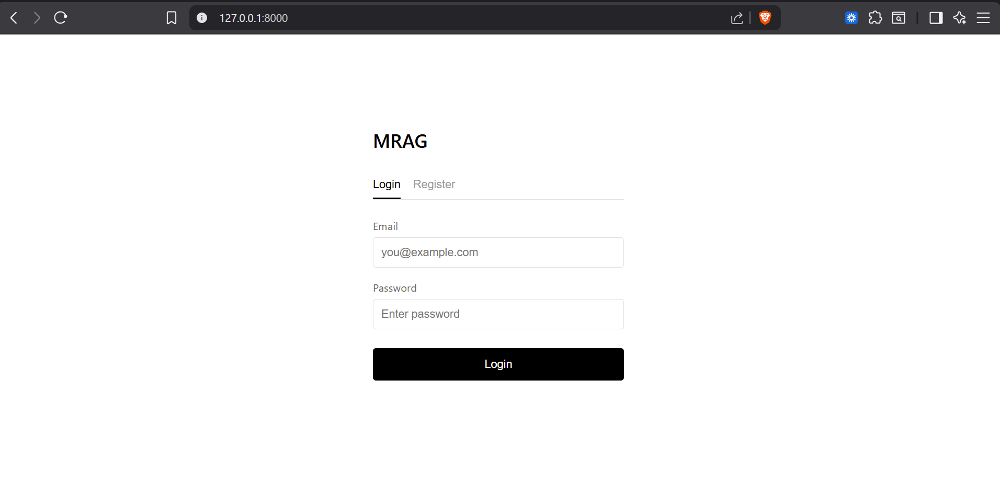
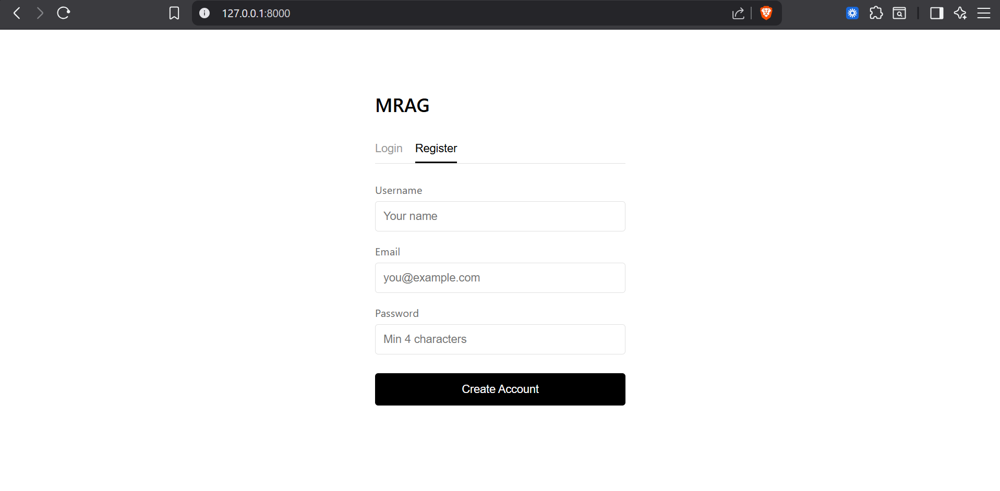
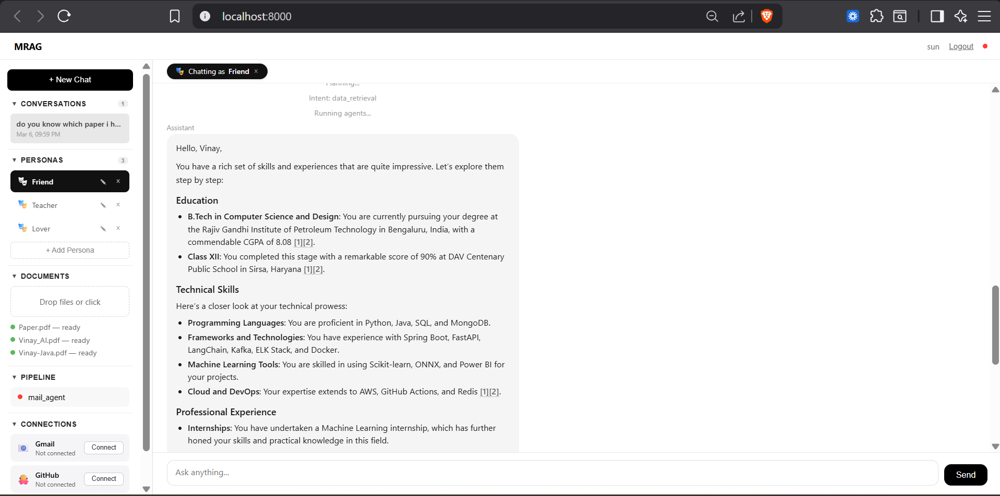


- http://localhost:8080/dashboard.html  
```
run frontend/dashboard.py then open dashboard.html
```
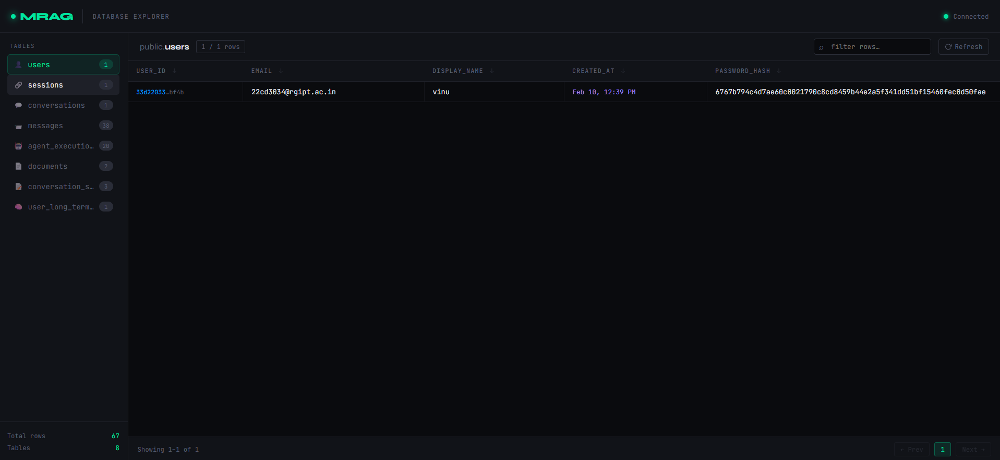


### Backend:
- http://localhost:8000/docs#/
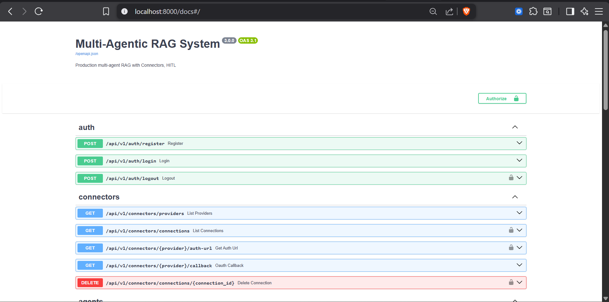

---

## System Architecture

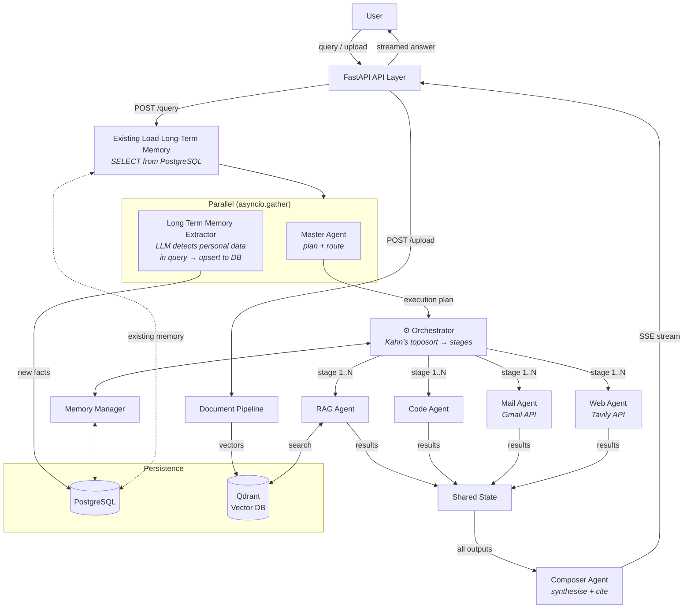
```mermaid
graph TB
    User["User"] -->|query / upload| API["FastAPI API Layer"]

    API -->|POST /query| LoadMem["Existing Load Long-Term Memory<br/><i>SELECT from PostgreSQL</i>"]
    API -->|POST /upload| DocPipeline["Document Pipeline"]

    LoadMem --> ParallelBlock

    subgraph ParallelBlock["Parallel (asyncio.gather)"]
        direction LR
        Master["Master Agent<br/><i>plan + route</i>"]
        Extractor["Long Term Memory Extractor<br/><i>LLM detects personal data<br/>in query → upsert to DB</i>"]
    end

    Master -->|execution plan| Orchestrator["⚙️ Orchestrator<br/><i>Kahn's toposort → stages</i>"]
    Extractor -->|"new facts"| PG

    Orchestrator -->|stage 1..N| RAG["RAG Agent"]
    Orchestrator -->|stage 1..N| Code["Code Agent"]
    Orchestrator -->|stage 1..N| Mail["Mail Agent<br/><i>Gmail API</i>"]
    Orchestrator -->|stage 1..N| Web["Web Agent<br/><i>Tavily API</i>"]

    RAG -->|results| State["Shared State"]
    Code -->|results| State
    Mail -->|results| State
    Web -->|results| State

    State -->|all outputs| Composer["Composer Agent<br/><i>synthesise + cite</i>"]
    Composer -->|SSE stream| API
    API -->|streamed answer| User

    DocPipeline -->|vectors| Qdrant[("Qdrant<br/>Vector DB")]
    RAG <-->|search| Qdrant

    subgraph Persistence
        PG[("PostgreSQL")]
        Qdrant
    end

    Memory["Memory Manager"] <--> PG
    Orchestrator <--> Memory
    LoadMem <-.->|"existing memory"| PG
```

---

## Memory Extraction Pipeline

Every user query passes through a **parallel memory extraction layer** that runs alongside the Master Agent — zero added latency. The extractor uses an LLM to detect personal data (name, company, job title, tone preferences, etc.) and persists any new findings to PostgreSQL for future conversations.

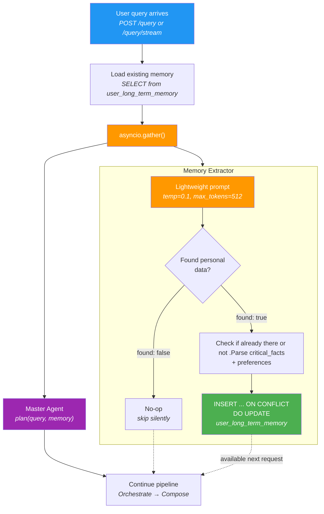
```mermaid
flowchart TD
    Query["User query arrives<br/><i>POST /query or /query/stream</i>"]

    Query --> LoadExisting["Load existing memory<br/><i>SELECT from user_long_term_memory</i>"]

    LoadExisting --> Fork["asyncio.gather()"]

    Fork --> MasterPlan["Master Agent<br/><i>plan(query, memory)</i>"]
    Fork --> Extract["Memory Extractor LLM"]

    subgraph Extract["Memory Extractor"]
        direction TB
        Prompt["Lightweight prompt<br/><i>temp=0.1, max_tokens=512</i>"]
        Prompt --> Check{"Found personal<br/>data?"}
        Check -->|"found: false"| NoOp["No-op<br/><i>skip silently</i>"]
        Check -->|"found: true"| Parse[" Check if already there or not .Parse critical_facts<br/>+ preferences"]
        Parse --> Upsert["INSERT ... ON CONFLICT<br/>DO UPDATE<br/><i>user_long_term_memory</i>"]
    end

    MasterPlan --> Continue["Continue pipeline<br/><i>Orchestrate → Compose</i>"]
    NoOp -.-> Continue
    Upsert -.->|"available next request"| Continue

    style Query fill:#2196F3,color:#fff
    style Fork fill:#FF9800,color:#fff
    style Prompt fill:#FF9800,color:#fff
    style Upsert fill:#4CAF50,color:#fff
    style MasterPlan fill:#9C27B0,color:#fff
```

### What gets extracted

| Category | Fields | Example trigger |
|----------|--------|-----------------|
| **CriticalFacts** | `user_name`, `company_name`, `job_title`, `recent_projects` | *"I am Vinay working on RAG Project at Google"* |
| **UserPreferences** | `tone`, `detail_level`, `language` | *"Keep answers short and casual"* |

---

## Query Execution Patterns

The Master Agent produces an execution plan where agents can depend on each other. The Orchestrator uses **Kahn's topological sort** to group agents into parallel stages. Here are the three main patterns:

### 1. Parallel Execution (No Dependencies)

When agents are independent, they all run in **Stage 1** simultaneously.

> *Example: "Search my docs for Q3 revenue AND find the latest news about our competitor"*

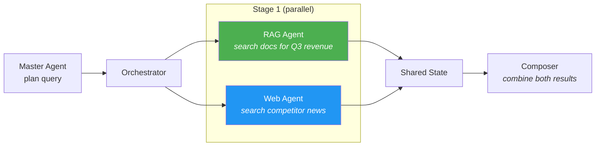
```mermaid
graph LR
    Master["Master Agent<br/>plan query"] --> Orchestrator

    subgraph "Stage 1 (parallel)"
        RAG["RAG Agent<br/><i>search docs for Q3 revenue</i>"]
        Web["Web Agent<br/><i>search competitor news</i>"]
    end

    Orchestrator --> RAG
    Orchestrator --> Web
    RAG --> State["Shared State"]
    Web --> State
    State --> Composer["Composer<br/><i>combine both results</i>"]

    style RAG fill:#4CAF50,color:#fff
    style Web fill:#2196F3,color:#fff
```

**Dependency graph:**
```
RAG Agent  → (no depdends)  ─┐
                          ├─► Composer
Web Agent  → (no depdends)  ─┘
```

---

### 2. Sequential Execution (Linear Chain)

Each agent depends on the previous one's output, creating a strict pipeline.

> *Example: "Find sales data in my docs, write Python code to analyze the trend, then email the report to my manager"*

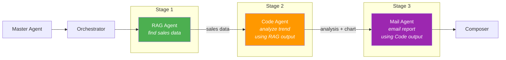
```mermaid
graph LR
    Master["Master Agent"] --> Orchestrator

    subgraph "Stage 1"
        RAG["RAG Agent<br/><i>find sales data</i>"]
    end

    subgraph "Stage 2"
        Code["Code Agent<br/><i>analyze trend<br/>using RAG output</i>"]
    end

    subgraph "Stage 3"
        Mail["Mail Agent<br/><i>email report<br/>using Code output</i>"]
    end

    Orchestrator --> RAG
    RAG -->|"sales data"| Code
    Code -->|"analysis + chart"| Mail
    Mail --> Composer["Composer"]

    style RAG fill:#4CAF50,color:#fff
    style Code fill:#FF9800,color:#fff
    style Mail fill:#9C27B0,color:#fff
```

**Dependency graph:**
```
RAG Agent ──► Code Agent ──► Mail Agent ──► Composer
 (stage 1)    (stage 2)      (stage 3)
```

---

### 3. Diamond Execution (Fan-out + Fan-in)

Multiple agents run in parallel, then a downstream agent combines their results.

> *Example: "Search my docs for the budget, also find public benchmarks online, then write code to compare them"*

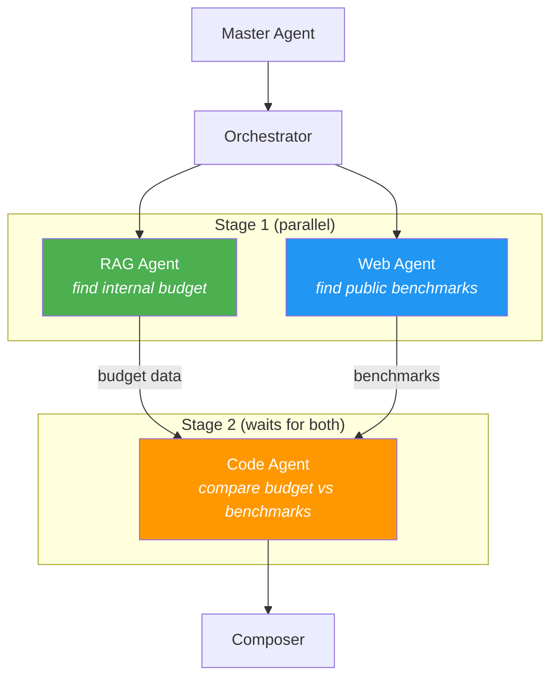
```mermaid
graph TD
    Master["Master Agent"] --> Orchestrator

    subgraph "Stage 1 (parallel)"
        RAG["RAG Agent<br/><i>find internal budget</i>"]
        Web["Web Agent<br/><i>find public benchmarks</i>"]
    end

    subgraph "Stage 2 (waits for both)"
        Code["Code Agent<br/><i>compare budget vs benchmarks</i>"]
    end

    Orchestrator --> RAG
    Orchestrator --> Web
    RAG -->|"budget data"| Code
    Web -->|"benchmarks"| Code
    Code --> Composer["Composer"]

    style RAG fill:#4CAF50,color:#fff
    style Web fill:#2196F3,color:#fff
    style Code fill:#FF9800,color:#fff
```

**Dependency graph:**
```
RAG Agent  ──┐
             ├──► Code Agent ──► Composer
Web Agent  ──┘
 (stage 1)      (stage 2)
```

---

### How Kahn's Algorithm Creates Stages

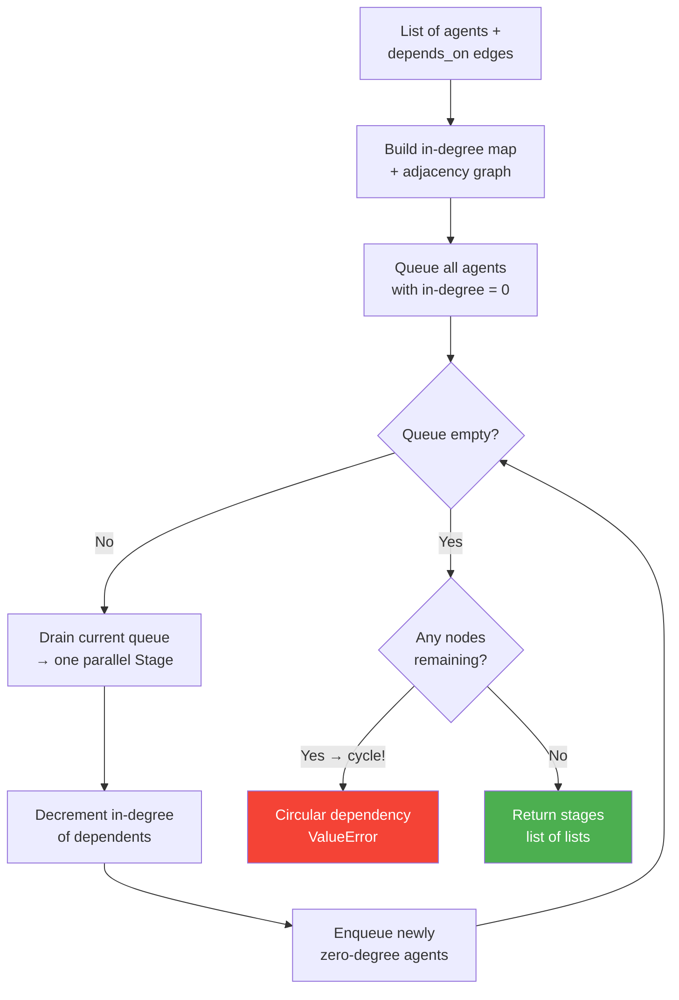
```mermaid
flowchart TD
    Input["List of agents +<br/>depends_on edges"] --> Build["Build in-degree map<br/>+ adjacency graph"]
    Build --> Init["Queue all agents<br/>with in-degree = 0"]
    Init --> Loop{"Queue empty?"}
    Loop -->|No| Drain["Drain current queue<br/>→ one parallel Stage"]
    Drain --> Decrement["Decrement in-degree<br/>of dependents"]
    Decrement --> Enqueue["Enqueue newly<br/>zero-degree agents"]
    Enqueue --> Loop
    Loop -->|Yes| Check{"Any nodes<br/>remaining?"}
    Check -->|"Yes → cycle!"| Error["Circular dependency<br/>ValueError"]
    Check -->|No| Done["Return stages<br/>list of lists"]

    style Error fill:#f44336,color:#fff
    style Done fill:#4CAF50,color:#fff
```

---

## RAG Document Pipeline — How Documents Are Processed

When a user uploads a document, it goes through this pipeline before it's searchable:

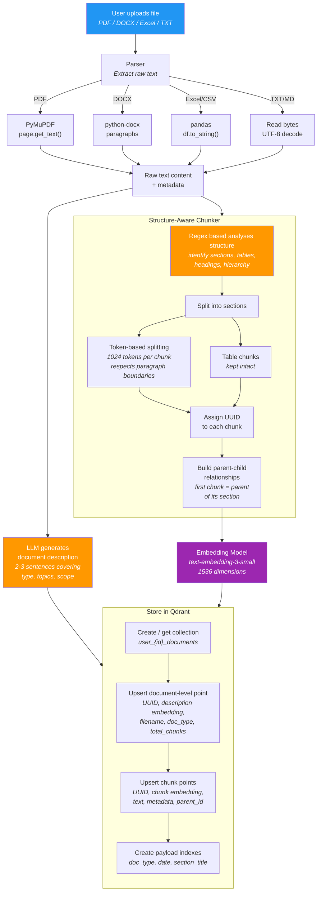
```mermaid
flowchart TD
    Upload["User uploads file<br/><i>PDF / DOCX / Excel / TXT</i>"]

    Upload --> Parser["Parser<br/><i>Extract raw text</i>"]

    Parser -->|"PDF"| PyMuPDF["PyMuPDF<br/>page.get_text()"]
    Parser -->|"DOCX"| PythonDocx["python-docx<br/>paragraphs"]
    Parser -->|"Excel/CSV"| Pandas["pandas<br/>df.to_string()"]
    Parser -->|"TXT/MD"| RawText["Read bytes<br/>UTF-8 decode"]

    PyMuPDF --> RawContent["Raw text content<br/>+ metadata"]
    PythonDocx --> RawContent
    Pandas --> RawContent
    RawText --> RawContent

    RawContent --> Describe["LLM generates<br/>document description<br/><i>2-3 sentences covering<br/>type, topics, scope</i>"]

    RawContent --> Chunker

    subgraph Chunker["Structure-Aware Chunker"]
        direction TB
        LLMParse["Regex based analyses structure<br/><i>identify sections, tables,<br/>headings, hierarchy</i>"]
        LLMParse --> SplitSections["Split into sections"]
        SplitSections --> TokenSplit["Token-based splitting<br/><i>1024 tokens per chunk<br/>respects paragraph boundaries</i>"]
        SplitSections --> TableChunk["Table chunks<br/><i>kept intact</i>"]
        TokenSplit --> UUIDs["Assign UUID<br/>to each chunk"]
        TableChunk --> UUIDs
        UUIDs --> Relationships["Build parent-child<br/>relationships<br/><i>first chunk = parent<br/>of its section</i>"]
    end

    Describe --> Store
    Relationships --> Embedder

    Embedder["Embedding Model<br/><i>text-embedding-3-small<br/>1536 dimensions</i>"]

    Embedder --> Store

    Store["Qdrant Vector Store"]

    subgraph Store["Store in Qdrant"]
        direction TB
        Collection["Create / get collection<br/><i>user_{id}_documents</i>"]
        Collection --> DocPoint["Upsert document-level point<br/><i>UUID, description embedding,<br/>filename, doc_type, total_chunks</i>"]
        DocPoint --> ChunkPoints["Upsert chunk points<br/><i>UUID, chunk embedding,<br/>text, metadata, parent_id</i>"]
        ChunkPoints --> PayloadIdx["Create payload indexes<br/><i>doc_type, date, section_title</i>"]
    end

    style Upload fill:#2196F3,color:#fff
    style Describe fill:#FF9800,color:#fff
    style LLMParse fill:#FF9800,color:#fff
    style Embedder fill:#9C27B0,color:#fff
```

---

## RAG Query Pipeline — How Retrieval Works

When the RAG Agent receives a query, this is the retrieval + synthesis flow:

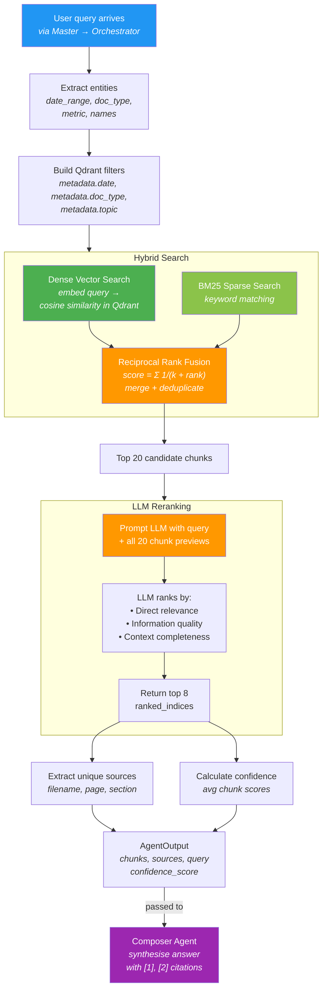
```mermaid
flowchart TD
    Query["User query arrives<br/><i>via Master → Orchestrator</i>"]

    Query --> Entities["Extract entities<br/><i>date_range, doc_type,<br/>metric, names</i>"]
    Entities --> Filters["Build Qdrant filters<br/><i>metadata.date, metadata.doc_type,<br/>metadata.topic</i>"]

    Filters --> Hybrid

    subgraph Hybrid["Hybrid Search"]
        direction TB
        Dense["Dense Vector Search<br/><i>embed query →<br/>cosine similarity in Qdrant</i>"]
        Sparse["BM25 Sparse Search<br/><i>keyword matching</i>"]
        Dense --> RRF["Reciprocal Rank Fusion<br/><i>score = Σ 1/(k + rank)<br/>merge + deduplicate</i>"]
        Sparse --> RRF
    end

    RRF --> Top20["Top 20 candidate chunks"]

    Top20 --> Rerank

    subgraph Rerank["LLM Reranking"]
        direction TB
        RePrompt["Prompt LLM with query<br/>+ all 20 chunk previews"]
        RePrompt --> Score["LLM ranks by:<br/>• Direct relevance<br/>• Information quality<br/>• Context completeness"]
        Score --> Top8["Return top 8<br/>ranked_indices"]
    end

    Top8 --> Sources["Extract unique sources<br/><i>filename, page, section</i>"]
    Top8 --> Confidence["Calculate confidence<br/><i>avg chunk scores</i>"]

    Sources --> Output["AgentOutput<br/><i>chunks, sources, query<br/>confidence_score</i>"]
    Confidence --> Output

    Output -->|"passed to"| Composer["Composer Agent<br/><i>synthesise answer<br/>with [1], [2] citations</i>"]

    style Query fill:#2196F3,color:#fff
    style Dense fill:#4CAF50,color:#fff
    style Sparse fill:#8BC34A,color:#fff
    style RRF fill:#FF9800,color:#fff
    style RePrompt fill:#FF9800,color:#fff
    style Composer fill:#9C27B0,color:#fff
```

---

## Gmail Agent Flow

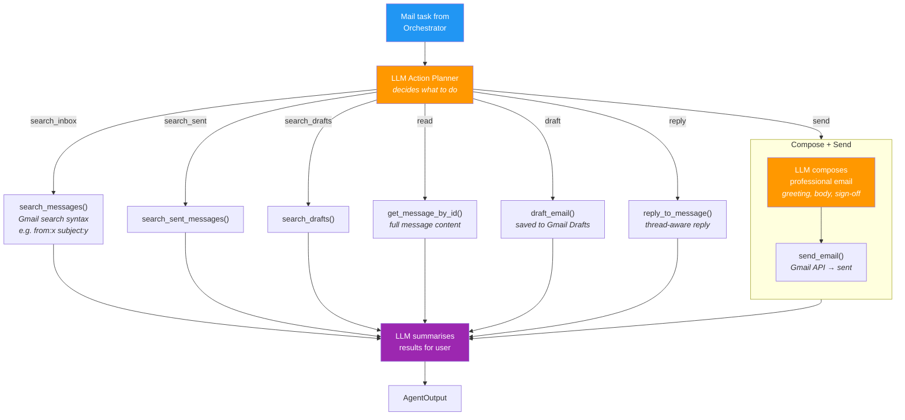
```mermaid
flowchart TD
    Task["Mail task from<br/>Orchestrator"]

    Task --> Planner["LLM Action Planner<br/><i>decides what to do</i>"]

    Planner -->|"search_inbox"| SearchInbox["search_messages()<br/><i>Gmail search syntax<br/>e.g. from:x subject:y</i>"]
    Planner -->|"search_sent"| SearchSent["search_sent_messages()"]
    Planner -->|"search_drafts"| SearchDrafts["search_drafts()"]
    Planner -->|"read"| ReadMsg["get_message_by_id()<br/><i>full message content</i>"]
    Planner -->|"send"| Compose

    subgraph Compose["Compose + Send"]
        direction TB
        LLMCompose["LLM composes<br/>professional email<br/><i>greeting, body, sign-off</i>"]
        LLMCompose --> SendGmail["send_email()<br/><i>Gmail API → sent</i>"]
    end

    Planner -->|"draft"| Draft["draft_email()<br/><i>saved to Gmail Drafts</i>"]
    Planner -->|"reply"| Reply["reply_to_message()<br/><i>thread-aware reply</i>"]

    SearchInbox --> Summarise["LLM summarises<br/>results for user"]
    SearchSent --> Summarise
    SearchDrafts --> Summarise
    ReadMsg --> Summarise
    Compose --> Summarise
    Draft --> Summarise
    Reply --> Summarise

    Summarise --> Output["AgentOutput"]

    style Task fill:#2196F3,color:#fff
    style Planner fill:#FF9800,color:#fff
    style LLMCompose fill:#FF9800,color:#fff
    style Summarise fill:#9C27B0,color:#fff
```

---

## Tavily Web Search Agent Flow

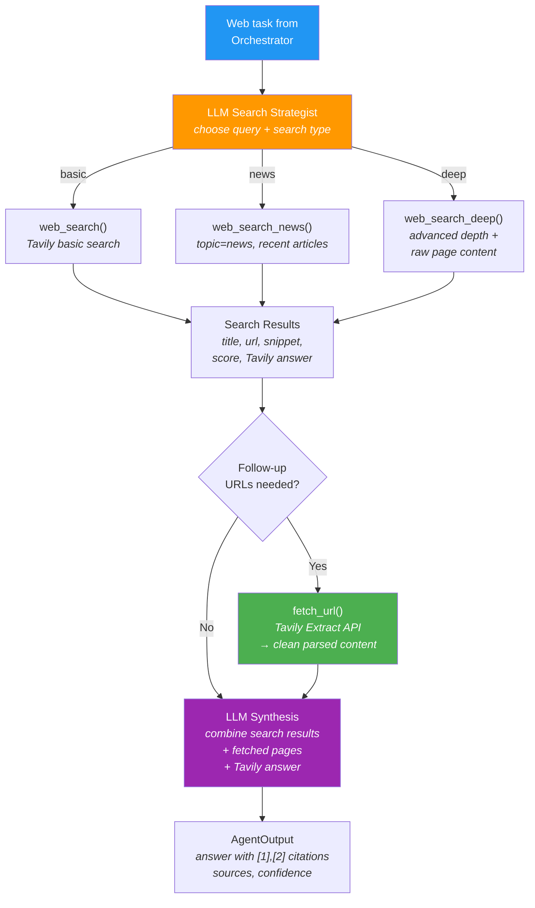
```mermaid
flowchart TD
    Task["Web task from<br/>Orchestrator"]

    Task --> Strategy["LLM Search Strategist<br/><i>choose query + search type</i>"]

    Strategy -->|"basic"| Basic["web_search()<br/><i>Tavily basic search</i>"]
    Strategy -->|"news"| News["web_search_news()<br/><i>topic=news, recent articles</i>"]
    Strategy -->|"deep"| Deep["web_search_deep()<br/><i>advanced depth +<br/>raw page content</i>"]

    Basic --> Results["Search Results<br/><i>title, url, snippet,<br/>score, Tavily answer</i>"]
    News --> Results
    Deep --> Results

    Results --> FollowUp{"Follow-up<br/>URLs needed?"}
    FollowUp -->|Yes| Fetch["fetch_url()<br/><i>Tavily Extract API<br/>→ clean parsed content</i>"]
    FollowUp -->|No| Synth

    Fetch --> Synth["LLM Synthesis<br/><i>combine search results<br/>+ fetched pages<br/>+ Tavily answer</i>"]

    Synth --> Output["AgentOutput<br/><i>answer with [1],[2] citations<br/>sources, confidence</i>"]

    style Task fill:#2196F3,color:#fff
    style Strategy fill:#FF9800,color:#fff
    style Fetch fill:#4CAF50,color:#fff
    style Synth fill:#9C27B0,color:#fff
```

---

## Database Storage Reference

### PostgreSQL — Tables

| Table | Purpose | Key Columns |
|-------|---------|-------------|
| **`users`** | Registered users | `user_id` (UUID PK), `email`, `display_name`, `created_at`,`password`,`username` |
| **`sessions`** | Login/chat sessions | `session_id` (UUID PK), `user_id` (FK), `started_at`, `is_active` |
| **`conversations`** | Conversation threads within a session | `conversation_id` (UUID PK), `session_id` (FK), `user_id` (FK), `title` |
| **`messages`** | Individual messages in a conversation | `message_id` (UUID PK), `conversation_id` (FK), `role` (`user`/`assistant`/`system`), `content`, `metadata` (JSONB) |
| **`agent_executions`** | Audit log of every agent run | `execution_id` (UUID PK), `conversation_id` (FK), `agent_name`, `status` (`pending`/`running`/`success`/`failed`), `input_payload` (JSONB), `output_payload` (JSONB), `error_message` |
| **`documents`** | Uploaded document metadata | `doc_id` (UUID PK), `user_id` (FK), `filename`, `doc_type`, `total_chunks`, `qdrant_collection` |
| **`conversation_summaries`** | Rolling summaries of every 3 conversation turns | `summary_id` (UUID PK), `conversation_id` (FK), `summary_text`, `turns_covered` |
| **`user_long_term_memory`** | Persistent user profile extracted by the Memory Extractor | `user_id` (UUID PK), `critical_facts` (JSONB), `preferences` (JSONB), `updated_at` |
| **`hitl_requests`** | HITL approval requests for agents with dangerous tools | `request_id` (UUID PK), `conversation_id` (FK), `agent_id`, `agent_name`, `tool_names` (TEXT[]), `status` (`pending`/`approved`/`denied`/`timed_out`/`expired`), `user_instructions`, `expires_at` |
| **`user_connections`** | OAuth connections per user per provider | `connection_id` (UUID PK), `user_id` (FK), `provider` (VARCHAR), `account_label`, `account_id`, `access_token` (encrypted), `refresh_token` (encrypted), `expires_at`, `scopes` (TEXT[]), `provider_meta` (JSONB), `status` (`active`/`expired`/`error`/`revoked`) |

#### `user_long_term_memory` — JSONB Column Detail

```
critical_facts                          preferences
┌────────────────────────────────┐      ┌──────────────────────────┐
│ user_name    : "vinu"    │      │ tone         : "casual"  │
│ company_name : "Google"     │      │ detail_level : "detailed"│
│ job_title    : "AI Engineer" │      │ language     : "en"      │
│ recent_projects: ["RAGA",     │      └──────────────────────────┘
│                   "Beta"]      │
└────────────────────────────────┘
```

### Qdrant — Vector Collections

Each user gets a dedicated collection: **`user_{user_id}_documents`**

| Point Type | Stored Payload Fields | Purpose |
|------------|----------------------|---------|
| **`document_entry`** | `doc_id`, `filename`, `description`, `doc_type`, `uploaded_at`, `total_chunks` | Document-level vector for broad retrieval |
| **`chunk`** | `text`, `metadata` (`filename`, `page`, `section_title`, `doc_type`, `date`, …) | Individual text chunk for fine-grained search |

**Vector config:** `text-embedding-3-small` (1536 dimensions), cosine distance.

**Payload indexes:** `metadata.doc_type` (keyword), `metadata.date` (keyword), `metadata.section_title` (text).

---

## Agent Input / Output Reference

Every agent receives an **`AgentInput`** and returns an **`AgentOutput`**. These are Pydantic models defined in `utils/schemas.py`.

### Common Input — `AgentInput`

| Field | Type | Description |
|-------|------|-------------|
| `agent_id` | `str` | Unique instance ID (e.g. `rag_agent-a1b2c3`) |
| `agent_name` | `str` | Agent type (`rag_agent`, `code_agent`, …) |
| `task` | `str` | Natural-language task description from the Master Agent |
| `entities` | `Dict` | Extracted entities (`date_range`, `metric`, `names`, `doc_type`, …) |
| `tools` | `List[str]` | Tools this agent is allowed to use |
| `conversation_history` | `List[Dict]` | Recent conversation context |
| `long_term_memory` | `Dict` | `{critical: {...}, preferences: {...}}` — user profile |
| `dependency_outputs` | `Dict` | Outputs from upstream agents (`dep_agent_id → data`) |
| `retry_config` | `Dict` | `{max_retries, timeout, backoff_multiplier}` |
| `metadata` | `Dict` | `{user_id, query_id, session_id}` |

### Common Output — `AgentOutput`

| Field | Type | Description |
|-------|------|-------------|
| `agent_id` | `str` | Same ID from input |
| `agent_name` | `str` | Agent type |
| `task_description` | `str` | What was asked |
| `task_done` | `bool` | `true` on success, `false` on failure/timeout |
| `data` | `Dict` | Full results (agent-specific, see below) |
| `partial_data` | `Dict` | Partial results on timeout/failure |
| `error` | `str` | Error message if failed |
| `confidence_score` | `float` | 0.0 – 1.0 |
| `depends_on` | `List[str]` | IDs of upstream agents this depended on |
| `resource_usage` | `Dict` | `{time_taken_ms, tokens_used, api_calls_made, …}` |
| `metadata` | `Dict` | `{sources, citations, model_used}` |

### Per-Agent `data` Output

#### RAG Agent

```json
{
  "chunks": [
    {"chunk_id": "uuid", "score": 0.92, "text": "...", "metadata": {"filename": "report.pdf", "page": 3, "section_title": "Revenue"}}
  ],
  "sources": [
    {"type": "document", "source": "report.pdf", "page": 3, "section": "Revenue"}
  ],
  "query": "What was Q3 revenue?"
}
```

| Key | Description |
|-----|-------------|
| `chunks` | Top-8 reranked document chunks with text, score, and metadata |
| `sources` | Deduplicated list of source documents cited |
| `query` | The original search query |

#### Code Agent

```json
{
  "code": "import json\ndata = {...}\nprint(json.dumps(data, indent=2))",
  "stdout": "{\"total\": 42}",
  "stderr": "",
  "exit_code": 0
}
```

| Key | Description |
|-----|-------------|
| `code` | The generated Python code |
| `stdout` | Standard output from execution |
| `stderr` | Standard error (if any) |
| `exit_code` | `0` = success, non-zero = failure |

#### Mail Agent

```json
{
  "action": "search_inbox",
  "messages": [
    {"id": "msg-id", "from": "bob@example.com", "subject": "Q3 Report", "date": "2026-01-15", "snippet": "..."}
  ],
  "count": 5
}
```

| Action | Extra `data` keys | Description |
|--------|-------------------|-------------|
| `search_inbox` / `search_sent` | `messages`, `count` | List of matching messages |
| `search_drafts` | `drafts`, `count` | List of matching drafts |
| `read` | `message` | Full message content |
| `send` | `sent` | Confirmation + message ID |
| `draft` | `draft` | Created draft details |
| `reply` | `reply` | Reply confirmation |

Also returns a `result` field with an LLM-generated human-readable summary.

#### Web Search Agent

```json
{
  "search_query": "Python async best practices 2026",
  "search_type": "basic",
  "tavily_answer": "Short AI-generated answer from Tavily...",
  "search_results": [
    {"title": "...", "url": "https://...", "snippet": "...", "score": 0.95}
  ],
  "fetched_pages": 2,
  "sources": [
    {"type": "web", "source": "Article Title", "url": "https://...", "excerpt": "...", "relevance_score": 0.95}
  ]
}
```

| Key | Description |
|-----|-------------|
| `search_query` | The optimised query sent to Tavily |
| `search_type` | `basic`, `news`, or `deep` |
| `tavily_answer` | Tavily's AI-generated direct answer (if available) |
| `search_results` | Raw results with title, URL, snippet, score |
| `fetched_pages` | Number of pages deep-fetched for richer content |
| `sources` | Formatted source list for citations |

Also returns a `result` field with the LLM-synthesised final answer.

### Master Agent → Composer Pipeline

```
User Query
    │
    ▼
┌────────────┐   ResolvedMasterOutput    ┌──────────────┐
│ Master     │ ────────────────────────▶ │ Orchestrator │
│ Agent      │   • analysis.intent       │              │
│            │   • analysis.entities     │  runs agents │
│            │   • execution_plan        │  in stages   │
└────────────┘     (agent tasks +        └──────┬───────┘
                    dependencies)                │
                                                 ▼
                                     Dict[agent_id → AgentOutput]
                                                 │
                                                 ▼
                                         ┌──────────────┐   ComposerOutput
                                         │  Composer    │ ──────────────▶ User
                                         │  Agent       │   • answer (str)
                                         │              │   • sources
                                         └──────────────┘
```

---

## Auth & Connectors Architecture

The system uses a modular architecture for authentication and third-party OAuth integrations.

### Project Structure

```
MRAG/
├── auth/                            # User authentication module
│   ├── __init__.py
│   ├── routes.py                    # POST /register, /login
│   ├── jwt.py                       # JWT create/verify (HMAC-SHA256)
│   ├── models.py                    # User ORM (re-exports from database/models.py)
│   ├── dependencies.py              # get_current_user_id() FastAPI dependency
│   └── password.py                  # bcrypt hash/verify
│
├── connectors/                      # OAuth connector module
│   ├── __init__.py
│   ├── routes.py                    # /providers, /auth-url, /callback, /connections
│   ├── base.py                      # BaseConnector abstract class
│   ├── gmail.py                     # GmailConnector(BaseConnector)
│   ├── models.py                    # UserConnection ORM (re-exports from database/models.py)
│   ├── registry.py                  # ConnectorRegistry (auto-discover at startup)
│   ├── token_manager.py             # get/store/refresh/revoke per-user tokens
│   └── encryption.py                # Fernet AES encryption for tokens at rest
│
├── api/                             # AI routes (unchanged)
│   ├── routes.py                    # /query, /hitl/respond
│   ├── streaming.py                 # /query/stream (SSE)
│   └── middleware.py
│
├── agents/                          # Agent implementations
├── core/                            # Orchestrator, Master, Composer
├── tools/                           # Tool functions (mail_tools uses connectors)
└── ...
```

### Security Configuration

All secrets are loaded from environment variables via `config/settings.py`:

| Env Var | Purpose | Generate with |
|---------|---------|---------------|
| `JWT_SECRET` | HMAC-SHA256 signing key for auth tokens | `python -c "import secrets; print(secrets.token_urlsafe(48))"` |
| `JWT_EXPIRY_SECONDS` | Token TTL (default: 604800 = 7 days) | — |
| `OAUTH_STATE_SECRET` | HMAC key for OAuth CSRF state tokens | `python -c "import secrets; print(secrets.token_urlsafe(48))"` |
| `TOKEN_ENCRYPTION_KEY` | Fernet key for encrypting OAuth tokens at rest | `python -c "from cryptography.fernet import Fernet; print(Fernet.generate_key().decode())"` |

#### Password Hashing

Passwords are hashed with **bcrypt** (work factor 12, auto-salted):

```python
# auth/password.py
from auth.password import hash_password, verify_password

hashed = hash_password("user-password")       # $2b$12$...
ok     = verify_password("user-password", hashed)  # True
```

#### Token Encryption at Rest

OAuth access tokens and refresh tokens are encrypted with **Fernet (AES-128-CBC + HMAC-SHA256)** before being stored in PostgreSQL. This is handled transparently by `connectors/encryption.py`:

```
Store flow:   plaintext_token → encrypt_token() → ciphertext → DB column
Read flow:    DB column → ciphertext → decrypt_token() → plaintext_token
```

- If `TOKEN_ENCRYPTION_KEY` is not set, tokens are stored as plaintext (with a warning)
- Tokens stored before encryption was enabled are handled gracefully (auto-detected and returned as-is)
- All encryption/decryption is done inside `token_manager.py` — no other code needs to know about it

### OAuth Connector Flow

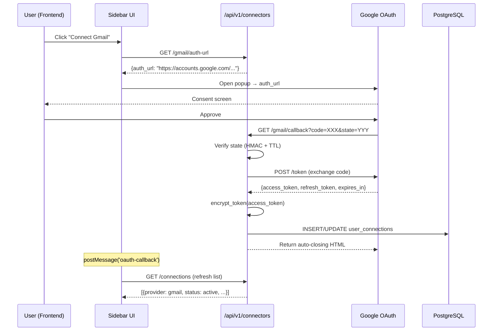
```mermaid
sequenceDiagram
    participant User as User (Frontend)
    participant FE as Sidebar UI
    participant API as /api/v1/connectors
    participant Google as Google OAuth
    participant DB as PostgreSQL

    User->>FE: Click "Connect Gmail"
    FE->>API: GET /gmail/auth-url
    API-->>FE: {auth_url: "https://accounts.google.com/..."}
    FE->>Google: Open popup → auth_url
    Google-->>User: Consent screen
    User->>Google: Approve
    Google->>API: GET /gmail/callback?code=XXX&state=YYY
    API->>API: Verify state (HMAC + TTL)
    API->>Google: POST /token (exchange code)
    Google-->>API: {access_token, refresh_token, expires_in}
    API->>API: encrypt_token(access_token)
    API->>DB: INSERT/UPDATE user_connections
    API-->>Google: Return auto-closing HTML
    Note over FE: postMessage('oauth-callback')
    FE->>API: GET /connections (refresh list)
    API-->>FE: [{provider: gmail, status: active, ...}]
```

### How Tools Use Connector Tokens (Production Pattern)

When any connector-backed agent runs, it retrieves a fresh per-user token on every request. Here's the production flow using the Gmail implementation as reference:

```
MailAgent.execute(task_config)
  → prepare_gmail_service(user_id)               # called once per request
    → get_active_token(user_id, "gmail")          # DB lookup + auto-refresh
      → SELECT from user_connections WHERE user_id + provider + status='active'
      → decrypt_token(access_token)
      → if expired → connector.refresh_access_token(decrypt(refresh_token))
                   → encrypt_token(new_access_token) → UPDATE DB
      → return plaintext access_token
    → asyncio.to_thread(build, "gmail", "v1", credentials=...)  # non-blocking
    → get_user_connections(user_id)               # resolve sender email
    → _current_gmail_service.set(service)         # ContextVar — request-scoped
    → _current_sender_email.set(email)            # ContextVar — request-scoped
  → tool functions call _get_service()            # reads ContextVar
    → await asyncio.to_thread(api_call.execute)   # non-blocking sync I/O
  → request ends → ContextVars garbage-collected  # no memory leak
```

**Key design principles:**

| Principle | Implementation |
|-----------|---------------|
| Fresh token every request | `get_active_token()` runs on every `execute()` call — never cached globally |
| Auto-refresh | `token_manager` checks `expires_at` with 120s buffer, refreshes transparently |
| Non-blocking I/O | All sync SDK calls wrapped in `asyncio.to_thread()` |
| Request-scoped state | `ContextVar` — automatically GC'd when the async task ends |
| No global singletons | No `_user_services` dict, no `_gmail_service` global |
| Graceful errors | If user has no connection → `RuntimeError` with clear "connect via UI" message |

This pattern applies to **all** connector-backed agents. Each provider follows the same structure — only the SDK and API calls change.

---

## How to Add a New Connector

Adding a new OAuth connector with tools and HITL is a **7-step process**. This guide shows the complete walkthrough with **two real examples**: **Slack** (REST API + `httpx`) and **GitHub** (REST API + `httpx`) — demonstrating both read-only and HITL-protected tools.

### Overview

```
┌──────────────────────────────────────────────────────────────────────────┐
│  Step 1 │ connectors/<provider>.py    — implement the OAuth connector   │
│  Step 2 │ connectors/registry.py      — register the connector          │
│  Step 3 │ config/settings.py + .env   — add client_id / secret          │
│  Step 4 │ tools/<provider>_tools.py   — tool functions + HITL flags     │
│  Step 5 │ agents/<provider>_agent/    — agent.py + prompts.py           │
│  Step 6 │ config/agent_registry.yaml  — register agent capabilities     │
│  Step 7 │ core/agent_factory.py       — wire agent instance             │
└──────────────────────────────────────────────────────────────────────────┘
```

---

### Step 1 — Create the Connector

Subclass `BaseConnector` and implement the OAuth methods.

#### Slack Example — `connectors/slack.py`

```python
"""SlackConnector — OAuth2 for Slack workspace access."""

from __future__ import annotations
import logging
from typing import Any, Dict, List
from urllib.parse import urlencode

import httpx
from config.settings import config
from connectors.base import BaseConnector

logger = logging.getLogger(__name__)

_SLACK_AUTH_URL = "https://slack.com/oauth/v2/authorize"
_SLACK_TOKEN_URL = "https://slack.com/api/oauth.v2.access"
_SLACK_REVOKE_URL = "https://slack.com/api/auth.revoke"


class SlackConnector(BaseConnector):

    @property
    def provider_name(self) -> str:
        return "slack"

    @property
    def display_name(self) -> str:
        return "Slack"

    @property
    def scopes(self) -> List[str]:
        return ["channels:read", "channels:history", "chat:write", "users:read"]

    @property
    def icon(self) -> str:
        return "💬"

    def is_configured(self) -> bool:
        return bool(config.slack_client_id and config.slack_client_secret)

    def _redirect_uri(self) -> str:
        return f"{config.oauth_redirect_base}/api/v1/connectors/slack/callback"

    def get_auth_url(self, state: str) -> str:
        params = {
            "client_id": config.slack_client_id,
            "redirect_uri": self._redirect_uri(),
            "scope": ",".join(self.scopes),
            "state": state,
        }
        return f"{_SLACK_AUTH_URL}?{urlencode(params)}"

    async def handle_callback(self, code: str) -> Dict[str, Any]:
        async with httpx.AsyncClient() as client:
            resp = await client.post(_SLACK_TOKEN_URL, data={
                "code": code,
                "client_id": config.slack_client_id,
                "client_secret": config.slack_client_secret,
                "redirect_uri": self._redirect_uri(),
            })
            resp.raise_for_status()
            data = resp.json()
            if not data.get("ok"):
                raise ValueError(f"Slack OAuth error: {data.get('error')}")

        return {
            "access_token": data["access_token"],
            "refresh_token": data.get("refresh_token"),
            "expires_in": data.get("expires_in", 43200),
            "scopes": data.get("scope", "").split(","),
            "account_id": data.get("team", {}).get("id", ""),
            "account_label": data.get("team", {}).get("name", "Slack Workspace"),
            "provider_meta": {
                "team_id": data.get("team", {}).get("id"),
                "team_name": data.get("team", {}).get("name"),
                "bot_user_id": data.get("bot_user_id"),
            },
        }

    async def refresh_access_token(self, refresh_token: str) -> Dict[str, Any]:
        # Slack V2 tokens with token rotation — implement per Slack docs
        raise NotImplementedError("Slack token refresh not yet supported")

    async def revoke_token(self, access_token: str) -> bool:
        try:
            async with httpx.AsyncClient() as client:
                resp = await client.post(
                    _SLACK_REVOKE_URL,
                    headers={"Authorization": f"Bearer {access_token}"},
                )
                return resp.json().get("ok", False)
        except Exception:
            return False
```

#### GitHub Example — `connectors/github.py`

```python
"""GitHubConnector — OAuth2 for GitHub API access."""

from __future__ import annotations
import logging
from typing import Any, Dict, List
from urllib.parse import urlencode

import httpx
from config.settings import config
from connectors.base import BaseConnector

logger = logging.getLogger(__name__)

_GH_AUTH_URL = "https://github.com/login/oauth/authorize"
_GH_TOKEN_URL = "https://github.com/login/oauth/access_token"
_GH_API = "https://api.github.com"


class GitHubConnector(BaseConnector):

    @property
    def provider_name(self) -> str:
        return "github"

    @property
    def display_name(self) -> str:
        return "GitHub"

    @property
    def scopes(self) -> List[str]:
        return ["repo", "read:user", "user:email"]

    @property
    def icon(self) -> str:
        return "🐙"

    def is_configured(self) -> bool:
        return bool(config.github_client_id and config.github_client_secret)

    def _redirect_uri(self) -> str:
        return f"{config.oauth_redirect_base}/api/v1/connectors/github/callback"

    def get_auth_url(self, state: str) -> str:
        params = {
            "client_id": config.github_client_id,
            "redirect_uri": self._redirect_uri(),
            "scope": " ".join(self.scopes),
            "state": state,
        }
        return f"{_GH_AUTH_URL}?{urlencode(params)}"

    async def handle_callback(self, code: str) -> Dict[str, Any]:
        async with httpx.AsyncClient() as client:
            # Exchange code for token
            resp = await client.post(
                _GH_TOKEN_URL,
                data={
                    "client_id": config.github_client_id,
                    "client_secret": config.github_client_secret,
                    "code": code,
                    "redirect_uri": self._redirect_uri(),
                },
                headers={"Accept": "application/json"},
            )
            resp.raise_for_status()
            data = resp.json()
            if "error" in data:
                raise ValueError(f"GitHub OAuth error: {data['error_description']}")

            # Fetch user profile
            user_resp = await client.get(
                f"{_GH_API}/user",
                headers={
                    "Authorization": f"Bearer {data['access_token']}",
                    "Accept": "application/vnd.github+json",
                },
            )
            user_resp.raise_for_status()
            user = user_resp.json()

        return {
            "access_token": data["access_token"],
            "refresh_token": data.get("refresh_token"),
            "expires_in": data.get("expires_in", 28800),  # 8h for GitHub Apps
            "scopes": data.get("scope", "").split(","),
            "account_id": str(user.get("id", "")),
            "account_label": user.get("login", ""),
            "provider_meta": {
                "login": user.get("login"),
                "name": user.get("name"),
                "avatar_url": user.get("avatar_url"),
            },
        }

    async def refresh_access_token(self, refresh_token: str) -> Dict[str, Any]:
        """GitHub App refresh — non-app tokens don't expire."""
        async with httpx.AsyncClient() as client:
            resp = await client.post(
                _GH_TOKEN_URL,
                data={
                    "client_id": config.github_client_id,
                    "client_secret": config.github_client_secret,
                    "refresh_token": refresh_token,
                    "grant_type": "refresh_token",
                },
                headers={"Accept": "application/json"},
            )
            resp.raise_for_status()
            data = resp.json()

        return {
            "access_token": data["access_token"],
            "refresh_token": data.get("refresh_token"),
            "expires_in": data.get("expires_in", 28800),
        }

    async def revoke_token(self, access_token: str) -> bool:
        try:
            async with httpx.AsyncClient() as client:
                resp = await client.delete(
                    f"{_GH_API}/applications/{config.github_client_id}/token",
                    auth=(config.github_client_id, config.github_client_secret),
                    json={"access_token": access_token},
                )
                return resp.status_code == 204
        except Exception:
            return False
```

**Key rules:**
- `provider_name` must be a unique slug — used in URLs (`/connectors/<provider>/callback`)
- `is_configured()` gates registration — connector is skipped at startup if credentials are missing
- `handle_callback()` must return the standardised dict: `access_token`, `refresh_token`, `expires_in`, `scopes`, `account_id`, `account_label`, `provider_meta`
- All HTTP calls use `httpx.AsyncClient` — never block the event loop

---

### Step 2 — Register in ConnectorRegistry

Add the import and instance to `_ALL_CONNECTORS` in `connectors/registry.py`:

```python
from connectors.slack import SlackConnector
from connectors.github import GitHubConnector

_ALL_CONNECTORS: List[BaseConnector] = [
    GmailConnector(),
    SlackConnector(),      # ← add
    GitHubConnector(),     # ← add
]
```

The registry auto-discovers configured connectors at startup. Unconfigured ones are skipped with a log warning — no crash.

---

### Step 3 — Add Config

Add credential fields to `config/settings.py`:

```python
# Inside class Settings:

    # ── Slack OAuth ───────────────────────────────────────────────────
    slack_client_id: str = ""
    slack_client_secret: str = ""

    # ── GitHub OAuth ──────────────────────────────────────────────────
    github_client_id: str = ""
    github_client_secret: str = ""
```

Add env vars to `.env`:

```env
# ── Slack OAuth ──────────────────────────────────────
# 1. https://api.slack.com/apps → Create New App
# 2. OAuth & Permissions → Add redirect URL:
#    http://localhost:8000/api/v1/connectors/slack/callback
SLACK_CLIENT_ID=
SLACK_CLIENT_SECRET=

# ── GitHub OAuth ─────────────────────────────────────
# 1. https://github.com/settings/developers → New OAuth App
# 2. Set callback URL:
#    http://localhost:8000/api/v1/connectors/github/callback
GITHUB_CLIENT_ID=
GITHUB_CLIENT_SECRET=
```

---

### Step 4 — Create Tool Functions with HITL

Create `tools/<provider>_tools.py`. Mark read-only tools with `@tool("agent_name")` and irreversible tools with `@tool("agent_name", requires_approval=True)`.

**The HITL system auto-detects** tools with `requires_approval=True` at startup — no orchestrator changes needed. When the user triggers an irreversible tool, the HITL dialog fires automatically.

#### Slack Tools — `tools/slack_tools.py`

Tools use the token directly (no SDK — just `httpx`), so no ContextVar service object is needed. The agent fetches the token and passes it to each tool call.

```python
"""Slack tools — channel reading, search, messaging."""

from __future__ import annotations
import logging
from typing import Any, Dict, List

import httpx
from tools import tool

logger = logging.getLogger(__name__)
_SLACK_API = "https://slack.com/api"


async def _slack_api(token: str, method: str, **kwargs) -> Dict[str, Any]:
    """Call a Slack Web API method."""
    async with httpx.AsyncClient() as client:
        resp = await client.post(
            f"{_SLACK_API}/{method}",
            headers={"Authorization": f"Bearer {token}"},
            json=kwargs,
        )
        resp.raise_for_status()
        data = resp.json()
        if not data.get("ok"):
            raise ValueError(f"Slack API error: {data.get('error')}")
        return data


# ── Read-only tools (no approval) ─────────────────────────────────────

@tool("slack_agent")
async def list_channels(token: str) -> List[Dict[str, Any]]:
    """List public channels in the Slack workspace."""
    data = await _slack_api(token, "conversations.list", types="public_channel", limit=100)
    return [{"id": ch["id"], "name": ch["name"],
             "topic": ch.get("topic", {}).get("value", "")}
            for ch in data.get("channels", [])]


@tool("slack_agent")
async def read_channel_history(token: str, channel_id: str, limit: int = 20) -> List[Dict]:
    """Read recent messages from a channel."""
    data = await _slack_api(token, "conversations.history", channel=channel_id, limit=limit)
    return [{"user": m.get("user"), "text": m.get("text"), "ts": m.get("ts")}
            for m in data.get("messages", [])]


@tool("slack_agent")
async def search_slack_messages(token: str, query: str, count: int = 10) -> List[Dict]:
    """Search messages across the Slack workspace."""
    data = await _slack_api(token, "search.messages", query=query, count=count)
    return [{"channel": m.get("channel", {}).get("name"), "user": m.get("username"),
             "text": m.get("text"), "permalink": m.get("permalink")}
            for m in data.get("messages", {}).get("matches", [])]


# ── Irreversible tools (HITL required) ────────────────────────────────

@tool("slack_agent", requires_approval=True)
async def send_slack_message(token: str, channel_id: str, text: str) -> Dict[str, Any]:
    """
    Post a message to a Slack channel.
    ⚠️ requires_approval — triggers HITL dialog before execution.
    """
    data = await _slack_api(token, "chat.postMessage", channel=channel_id, text=text)
    return {"channel": data.get("channel"), "ts": data.get("ts"),
            "message": data.get("message", {}).get("text")}


@tool("slack_agent", requires_approval=True)
async def send_slack_dm(token: str, user_id: str, text: str) -> Dict[str, Any]:
    """
    Send a direct message to a Slack user.
    ⚠️ requires_approval — triggers HITL dialog before execution.
    """
    dm = await _slack_api(token, "conversations.open", users=user_id)
    channel_id = dm["channel"]["id"]
    data = await _slack_api(token, "chat.postMessage", channel=channel_id, text=text)
    return {"channel": channel_id, "ts": data.get("ts"), "message": text}
```

#### GitHub Tools — `tools/github_tools.py`

Same pattern — `httpx` REST calls, token passed from agent. Note the HITL distinction: reading repo info is safe, creating repos/PRs is not.

```python
"""GitHub tools — repo management, PR creation, info retrieval."""

from __future__ import annotations
import logging
from typing import Any, Dict, List, Optional

import httpx
from tools import tool

logger = logging.getLogger(__name__)
_GH_API = "https://api.github.com"


def _gh_headers(token: str) -> Dict[str, str]:
    return {"Authorization": f"Bearer {token}", "Accept": "application/vnd.github+json"}


# ── Read-only tools (no approval) ─────────────────────────────────────

@tool("github_agent")
async def get_repo_info(token: str, owner: str, repo: str) -> Dict[str, Any]:
    """Get repository metadata (description, stars, language, visibility)."""
    async with httpx.AsyncClient() as client:
        resp = await client.get(f"{_GH_API}/repos/{owner}/{repo}", headers=_gh_headers(token))
        resp.raise_for_status()
        data = resp.json()
    return {
        "full_name": data["full_name"], "description": data.get("description"),
        "language": data.get("language"), "stars": data["stargazers_count"],
        "forks": data["forks_count"], "open_issues": data["open_issues_count"],
        "visibility": data.get("visibility", "public"),
        "default_branch": data["default_branch"],
    }


@tool("github_agent")
async def list_repo_issues(
    token: str, owner: str, repo: str, state: str = "open", limit: int = 10,
) -> List[Dict[str, Any]]:
    """List issues in a repository."""
    async with httpx.AsyncClient() as client:
        resp = await client.get(
            f"{_GH_API}/repos/{owner}/{repo}/issues",
            headers=_gh_headers(token),
            params={"state": state, "per_page": min(limit, 30)},
        )
        resp.raise_for_status()
    return [{"number": i["number"], "title": i["title"], "state": i["state"],
             "user": i["user"]["login"], "labels": [l["name"] for l in i.get("labels", [])]}
            for i in resp.json() if "pull_request" not in i]


@tool("github_agent")
async def list_pull_requests(
    token: str, owner: str, repo: str, state: str = "open", limit: int = 10,
) -> List[Dict[str, Any]]:
    """List pull requests in a repository."""
    async with httpx.AsyncClient() as client:
        resp = await client.get(
            f"{_GH_API}/repos/{owner}/{repo}/pulls",
            headers=_gh_headers(token),
            params={"state": state, "per_page": min(limit, 30)},
        )
        resp.raise_for_status()
    return [{"number": p["number"], "title": p["title"], "state": p["state"],
             "user": p["user"]["login"], "head": p["head"]["ref"], "base": p["base"]["ref"]}
            for p in resp.json()]


# ── Irreversible tools (HITL required) ────────────────────────────────

@tool("github_agent", requires_approval=True)
async def create_repo(
    token: str, name: str, description: str = "", private: bool = False,
) -> Dict[str, Any]:
    """
    Create a new GitHub repository.
    ⚠️ requires_approval — creates a real repository on the user's account.
    """
    async with httpx.AsyncClient() as client:
        resp = await client.post(
            f"{_GH_API}/user/repos",
            headers=_gh_headers(token),
            json={"name": name, "description": description, "private": private, "auto_init": True},
        )
        resp.raise_for_status()
        data = resp.json()
    logger.info("create_repo → %s", data["full_name"])
    return {"full_name": data["full_name"], "url": data["html_url"],
            "private": data["private"], "default_branch": data["default_branch"]}


@tool("github_agent", requires_approval=True)
async def create_pull_request(
    token: str, owner: str, repo: str, title: str, head: str, base: str,
    body: str = "", draft: bool = False,
) -> Dict[str, Any]:
    """
    Create a pull request.
    ⚠️ requires_approval — opens a real PR on the repository.
    """
    async with httpx.AsyncClient() as client:
        resp = await client.post(
            f"{_GH_API}/repos/{owner}/{repo}/pulls",
            headers=_gh_headers(token),
            json={"title": title, "head": head, "base": base, "body": body, "draft": draft},
        )
        resp.raise_for_status()
        data = resp.json()
    logger.info("create_pull_request → %s#%d", f"{owner}/{repo}", data["number"])
    return {"number": data["number"], "title": data["title"], "url": data["html_url"],
            "state": data["state"], "head": head, "base": base}
```

**HITL decision guide — when to use `requires_approval=True`:**

| Category | Examples | `requires_approval` |
|----------|----------|-------------------|
| **Read / list / search** | `get_repo_info`, `list_channels`, `search_messages` | `False` |
| **Create / write / send** | `create_repo`, `create_pull_request`, `send_message` | `True` |
| **Delete / modify** | `delete_repo`, `close_issue`, `merge_pr` | `True` |

---

### Step 5 — Create the Agent

Create `agents/<provider>_agent/` with three files: `__init__.py`, `prompts.py`, `agent.py`.

**Two architecture patterns** depending on the SDK:

| Pattern | When to use | Token flow | Example |
|---------|-------------|-----------|---------|
| **ContextVar service** | SDK requires a client/service object (e.g. `googleapiclient`) | `prepare_*_service()` → ContextVar → `_get_service()` | Gmail |
| **Token pass-through** | REST API via `httpx` — no SDK object needed | `get_active_token()` → pass `token` to each tool call | Slack, GitHub |

#### Slack Agent — `agents/slack_agent/agent.py` (token pass-through)

```python
"""Slack Agent — workspace search, channel reading, messaging."""

from __future__ import annotations
import time
from typing import Any, Dict, List

from agents.base_agent import BaseAgent
from agents.slack_agent.prompts import SlackPrompts
from config.settings import config
from utils.schemas import AgentInput, AgentOutput

import logging
logger = logging.getLogger("slack_agent")


class SlackAgent(BaseAgent):
    def __init__(self, tool_registry, llm_provider):
        super().__init__("slack_agent", tool_registry)
        self.llm = llm_provider
        self.prompts = SlackPrompts()

    def get_required_tools(self) -> List[str]:
        return ["list_channels", "read_channel_history", "search_slack_messages",
                "send_slack_message", "send_slack_dm"]

    async def execute(self, task_config: AgentInput) -> AgentOutput:
        start = time.perf_counter()
        user_id = task_config.metadata.get("user_id", "")

        # ── Fresh token every request (no caching, no globals) ────────
        from connectors.token_manager import get_active_token
        token = await get_active_token(user_id, "slack")
        if not token:
            return AgentOutput(
                agent_id=task_config.agent_id,
                agent_name=self.agent_name,
                task_description=task_config.task,
                status="failed", task_done=False,
                result="Slack not connected. Please connect Slack via Settings → Connections.",
                data={"error": "not_connected"},
            )

        try:
            # HITL-aware effective task (handles enhance/override)
            effective_task = await self._effective_task(task_config)

            plan = await self.llm.generate(
                prompt=self.prompts.action_prompt(
                    task=effective_task,
                    entities=task_config.entities,
                    dependency_outputs=task_config.dependency_outputs,
                    long_term_memory=task_config.long_term_memory,
                ),
                temperature=config.get_agent_model_config("slack_agent")["temperature"],
                model=config.get_agent_model_config("slack_agent")["model"],
                output_schema={
                    "action": "list_channels | read_history | search | send_message | send_dm",
                    "params": "dict of tool parameters",
                    "reasoning": "string",
                },
            )
            if not isinstance(plan, dict):
                plan = {"action": "search", "params": {"query": task_config.task}}

            action = plan.get("action", "search")
            params = plan.get("params", {})
            result_data: Dict[str, Any] = {"action": action}

            # Token is passed directly to each tool — no ContextVar needed
            if action == "list_channels":
                tool_fn = self.get_tool("list_channels")
                result_data["channels"] = await tool_fn(token=token)

            elif action == "read_history":
                tool_fn = self.get_tool("read_channel_history")
                result_data["messages"] = await tool_fn(
                    token=token, channel_id=params.get("channel_id", ""), limit=params.get("limit", 20),
                )

            elif action == "search":
                tool_fn = self.get_tool("search_slack_messages")
                result_data["results"] = await tool_fn(
                    token=token, query=params.get("query", task_config.task),
                )

            elif action == "send_message":
                tool_fn = self.get_tool("send_slack_message")
                result_data["sent"] = await tool_fn(
                    token=token, channel_id=params.get("channel_id", ""), text=params.get("text", ""),
                )

            elif action == "send_dm":
                tool_fn = self.get_tool("send_slack_dm")
                result_data["sent"] = await tool_fn(
                    token=token, user_id=params.get("user_id", ""), text=params.get("text", ""),
                )

            return AgentOutput(
                agent_id=task_config.agent_id,
                agent_name=self.agent_name,
                task_description=effective_task,
                status="success", task_done=True,
                result=result_data.get("sent") or result_data.get("results")
                       or result_data.get("messages") or result_data.get("channels"),
                data=result_data,
                confidence_score=0.85,
                resource_usage={"time_taken_ms": int((time.perf_counter() - start) * 1000)},
                depends_on=list(task_config.dependency_outputs.keys()),
            )
        except Exception:
            logger.exception("[SlackAgent] Error")
            raise
```

#### GitHub Agent — `agents/github_agent/agent.py` (token pass-through)

```python
"""GitHub Agent — repo info, issues, PRs, repo/PR creation."""

from __future__ import annotations
import time
from typing import Any, Dict, List

from agents.base_agent import BaseAgent
from agents.github_agent.prompts import GitHubPrompts
from config.settings import config
from utils.schemas import AgentInput, AgentOutput

import logging
logger = logging.getLogger("github_agent")


class GitHubAgent(BaseAgent):
    def __init__(self, tool_registry, llm_provider):
        super().__init__("github_agent", tool_registry)
        self.llm = llm_provider
        self.prompts = GitHubPrompts()

    def get_required_tools(self) -> List[str]:
        return ["get_repo_info", "list_repo_issues", "list_pull_requests",
                "create_repo", "create_pull_request"]

    async def execute(self, task_config: AgentInput) -> AgentOutput:
        start = time.perf_counter()
        user_id = task_config.metadata.get("user_id", "")

        # ── Fresh token every request ─────────────────────────────────
        from connectors.token_manager import get_active_token
        token = await get_active_token(user_id, "github")
        if not token:
            return AgentOutput(
                agent_id=task_config.agent_id,
                agent_name=self.agent_name,
                task_description=task_config.task,
                status="failed", task_done=False,
                result="GitHub not connected. Please connect via Settings → Connections.",
                data={"error": "not_connected"},
            )

        try:
            effective_task = await self._effective_task(task_config)

            plan = await self.llm.generate(
                prompt=self.prompts.action_prompt(
                    task=effective_task,
                    entities=task_config.entities,
                    dependency_outputs=task_config.dependency_outputs,
                    long_term_memory=task_config.long_term_memory,
                ),
                temperature=config.get_agent_model_config("github_agent")["temperature"],
                model=config.get_agent_model_config("github_agent")["model"],
                output_schema={
                    "action": "repo_info | list_issues | list_prs | create_repo | create_pr",
                    "params": "dict of tool parameters",
                    "reasoning": "string",
                },
            )
            if not isinstance(plan, dict):
                plan = {"action": "repo_info", "params": {}}

            action = plan.get("action", "repo_info")
            params = plan.get("params", {})
            result_data: Dict[str, Any] = {"action": action}

            if action == "repo_info":
                tool_fn = self.get_tool("get_repo_info")
                result_data["repo"] = await tool_fn(
                    token=token, owner=params.get("owner", ""), repo=params.get("repo", ""),
                )

            elif action == "list_issues":
                tool_fn = self.get_tool("list_repo_issues")
                result_data["issues"] = await tool_fn(
                    token=token, owner=params.get("owner", ""), repo=params.get("repo", ""),
                    state=params.get("state", "open"),
                )

            elif action == "list_prs":
                tool_fn = self.get_tool("list_pull_requests")
                result_data["pull_requests"] = await tool_fn(
                    token=token, owner=params.get("owner", ""), repo=params.get("repo", ""),
                    state=params.get("state", "open"),
                )

            elif action == "create_repo":
                tool_fn = self.get_tool("create_repo")
                result_data["created"] = await tool_fn(
                    token=token, name=params.get("name", ""),
                    description=params.get("description", ""),
                    private=params.get("private", False),
                )

            elif action == "create_pr":
                tool_fn = self.get_tool("create_pull_request")
                result_data["pull_request"] = await tool_fn(
                    token=token, owner=params.get("owner", ""), repo=params.get("repo", ""),
                    title=params.get("title", ""), head=params.get("head", ""),
                    base=params.get("base", "main"), body=params.get("body", ""),
                )

            return AgentOutput(
                agent_id=task_config.agent_id,
                agent_name=self.agent_name,
                task_description=effective_task,
                status="success", task_done=True,
                result=result_data.get("created") or result_data.get("pull_request")
                       or result_data.get("repo") or result_data.get("issues")
                       or result_data.get("pull_requests"),
                data=result_data,
                confidence_score=0.85,
                resource_usage={"time_taken_ms": int((time.perf_counter() - start) * 1000)},
                depends_on=list(task_config.dependency_outputs.keys()),
            )
        except Exception:
            logger.exception("[GitHubAgent] Error")
            raise
```

#### When to Use ContextVar vs Token Pass-Through

If the provider has a **sync SDK that builds a client object** (like `googleapiclient`), use the Gmail pattern:

```python
# In tools/<provider>_tools.py — ContextVar pattern (for sync SDKs)

_current_service: contextvars.ContextVar[Any] = contextvars.ContextVar("_current_service", default=None)

async def prepare_service(user_id: str) -> None:
    """Called once per request by the agent's execute()."""
    token = await get_active_token(user_id, "provider_name")
    if not token:
        raise RuntimeError("Provider not connected.")
    creds = Credentials(token=token)
    service = await asyncio.to_thread(build_sdk_client, creds)   # non-blocking
    _current_service.set(service)

def _get_service():
    """Called by each tool function."""
    svc = _current_service.get(None)
    if svc is None:
        raise RuntimeError("Service not initialised. Call prepare_service() first.")
    return svc

# In the agent's execute():
async def execute(self, task_config):
    await prepare_service(user_id)     # fresh token → ContextVar
    # ... tools call _get_service() internally
```

If the provider uses a **REST API via `httpx`** (no SDK needed), pass the token directly — simpler and equally safe:

```python
# In the agent's execute() — token pass-through pattern (for REST APIs)
async def execute(self, task_config):
    token = await get_active_token(user_id, "provider_name")
    # ... pass token= to each tool call
```

Both patterns guarantee: fresh token per request, auto-refresh, no global state, no memory leak.

---

### Step 6 — Register the Agent

Add entries to `config/agent_registry.yaml`:

```yaml
  slack_agent:
    description: "Interacts with Slack — read channels, search messages, send messages"
    capabilities:
      - slack_read
      - slack_search
      - slack_send
    tools:
      - list_channels
      - read_channel_history
      - search_slack_messages
      - send_slack_message
      - send_slack_dm
    typical_use_cases:
      - "Search Slack for messages about deployment"
      - "Send a message to #general"
      - "Read the latest messages in #engineering"
    default_timeout: 30
    max_retries: 2

  github_agent:
    description: "Interacts with GitHub — repo info, issues, PRs, repo/PR creation"
    capabilities:
      - github_read
      - github_issues
      - github_prs
      - github_create
    tools:
      - get_repo_info
      - list_repo_issues
      - list_pull_requests
      - create_repo
      - create_pull_request
    typical_use_cases:
      - "Show me info about the MRAG repo"
      - "List open PRs on our project"
      - "Create a new repository called my-tool"
      - "Open a PR from feature-branch to main"
    default_timeout: 30
    max_retries: 2
```

Add model config to `config/settings.py`:

```python
    slack_model_provider: str = "openai"
    slack_model: str = "gpt-4o-mini"
    slack_temperature: float = 0.3

    github_model_provider: str = "openai"
    github_model: str = "gpt-4o-mini"
    github_temperature: float = 0.2
```

---

### Step 7 — Wire the Agent Instance

All agents are built centrally in `core/agent_factory.py`. Add your agents to `build_agent_instances()`:

```python
# core/agent_factory.py

from agents.slack_agent.agent import SlackAgent
from agents.github_agent.agent import GitHubAgent

def build_agent_instances(registry: ToolRegistry) -> Dict[str, BaseAgent]:
    # ... existing agents ...
    slack_cfg  = config.get_agent_model_config("slack_agent")
    github_cfg = config.get_agent_model_config("github_agent")

    return {
        # ... existing agents ...
        "slack_agent": SlackAgent(
            tool_registry=registry,
            llm_provider=get_llm_provider(slack_cfg["provider"], default_model=slack_cfg["model"]),
        ),
        "github_agent": GitHubAgent(
            tool_registry=registry,
            llm_provider=get_llm_provider(github_cfg["provider"], default_model=github_cfg["model"]),
        ),
    }
```

`api/routes.py` and `api/streaming.py` both call `build_agent_instances()` — you do **not** edit them.

---

### What Happens at Runtime

#### Example 1: "Send a deployment summary to #general on Slack"

```
1. Master Agent  → routes to slack_agent (capabilities match "slack_send")
2. Orchestrator  → checks slack_agent tools → send_slack_message has requires_approval=True
3. HITL triggers → SSE event "hitl_required" sent to frontend
4. User sees     → "slack_agent wants to use send_slack_message. Approve?"
5. User approves → optionally adds "add a 🚀 emoji at the end"
6. _effective_task() → classifies instructions as "enhance" → agent gets both tasks
7. Agent calls   → get_active_token(user_id, "slack") → fresh token from DB
8. Tool executes → send_slack_message(token, channel_id, text) → message posted
9. Composer      → synthesises "I posted the deployment summary to #general ✅"
```

#### Example 2: "Create a new repo called my-service on GitHub"

```
1. Master Agent  → routes to github_agent (capabilities match "github_create")
2. Orchestrator  → checks github_agent tools → create_repo has requires_approval=True
3. HITL triggers → "github_agent wants to use create_repo. Approve?"
4. User approves → "make it private"
5. _effective_task() → classifies as "enhance" → original task + user instruction merged
6. Agent calls   → get_active_token(user_id, "github") → fresh token
7. Tool executes → create_repo(token, name="my-service", private=True)
8. Composer      → "Created private repo my-service ✅ — https://github.com/you/my-service"
```

#### Example 3: "Show me open PRs on our project" (read-only, no HITL)

```
1. Master Agent  → routes to github_agent
2. Orchestrator  → checks tools → list_pull_requests has requires_approval=False
3. No HITL       → agent executes immediately
4. Agent calls   → get_active_token() → list_pull_requests(token, owner, repo)
5. Composer      → formats PR list as a readable summary
```

---

### Checklist

| # | File | Action |
|---|------|--------|
| 1 | `connectors/<provider>.py` | Subclass `BaseConnector` — OAuth flow |
| 2 | `connectors/registry.py` | Add instance to `_ALL_CONNECTORS` |
| 3 | `config/settings.py` + `.env` | Add `<provider>_client_id`, `<provider>_client_secret`, model config |
| 4 | `tools/<provider>_tools.py` | `@tool` (safe) and `@tool(requires_approval=True)` (irreversible) |
| 5 | `agents/<provider>_agent/` | `prompts.py` + `agent.py` with `_effective_task()` + token retrieval |
| 6 | `config/agent_registry.yaml` | Register capabilities, tools, use cases |
| 7 | `core/agent_factory.py` | Add agent to `build_agent_instances()` |

### What You Get for Free

| Feature | How |
|---------|-----|
| **OAuth UI** | "Connect" button auto-appears in sidebar for every registered connector |
| **Token management** | Auto-refresh, Fernet encryption at rest, revocation on disconnect |
| **HITL approval** | Any `requires_approval=True` tool triggers the approval dialog automatically |
| **HITL instructions** | User can modify task during approval — auto-classified as enhance/override |
| **Dashboard** | `user_connections` table shows all connections in admin dashboard |
| **"Not configured" UI** | If env vars missing → grayed out in sidebar with "Setup required" |
| **No orchestrator changes** | HITL, toposort, parallel execution — all work identically for new agents |

---

## Quick Start

```bash
cp .env.example .env
docker compose up -d postgres qdrant
uv sync
.venv\Scripts\activate
pip install -r requirements.txt
uv run uvicorn main:app --reload
```
---

## How to Add a New Agent with no HITL Tool basic one:

Adding a new agent is a **7-step process** touching 6 files (3 new, 3 existing). Below is a complete walkthrough using a fictional **`summary_agent`** as the example.

### Overview

```
┌─────────────────────────────────────────────────────────────────────┐
│  Step 1 │ config/agent_registry.yaml  — register capabilities      │
│  Step 2 │ config/settings.py          — add model/temp settings    │
│  Step 3 │ .env                        — set model env vars         │
│  Step 4 │ tools/summary_tools.py      — implement tool functions   │
│  Step 5 │ agents/summary_agent/       — prompts.py + agent.py      │
│  Step 6 │ core/agent_factory.py        — inject agent instance     │
│  Step 7 │ tests/                      — add agent tests   # Optional         │
└─────────────────────────────────────────────────────────────────────┘
```

---

### Step 1 — Register in `config/agent_registry.yaml`

The Master Agent reads this file to know what agents exist and when to select them. Append a new block:

```yaml
# config/agent_registry.yaml

agents:
  # ... existing agents ...

  summary_agent:
    description: "Generates concise summaries of long-form text, documents, or agent outputs"
    capabilities:
      - text_summarisation
      - key_point_extraction
      - executive_briefing
    tools:
      - summarise_text        # must match @tool function names in Step 4
      - extract_key_points
    typical_use_cases:
      - "Summarise this document in 3 bullet points"
      - "Give me an executive brief of last quarter's report"
      - "Condense these search results into a paragraph"
    default_timeout: 30
    max_retries: 2
```

**Key rules:**
- `capabilities` drives Master Agent's selection logic (what the agent *can* do)
- `tools` must exactly match the function names decorated with `@tool` in Step 4
- `typical_use_cases` are injected into the Master Agent prompt so it knows *when* to select this agent

---

### Step 2 — Add Model Settings in `config/settings.py`

Each agent gets its own model/provider/temperature triple:

```python
# config/settings.py — inside class Settings(BaseSettings):

    # ── Summary Agent Model ─────────────────────────────────────────────
    summary_model_provider: str = "openai"
    summary_model: str = "gpt-4o-mini"
    summary_temperature: float = 0.3
```

Then add the mapping in `get_agent_model_config()`:

```python
    mapping = {
        # ... existing agents ...
        "summary_agent": (self.summary_model_provider, self.summary_model, self.summary_temperature),
    }
```

---

### Step 3 — Add Env Vars to `.env` / `.env.example`

```env
# Summary Agent
SUMMARY_MODEL_PROVIDER=openai
SUMMARY_MODEL=gpt-4o-mini
SUMMARY_TEMPERATURE=0.3
```

---

### Step 4 — Create Tool Functions in `tools/summary_tools.py`

Every tool is a standalone async function decorated with `@tool("agent_name")`. The decorator declares which agents may call it.

```python
# tools/summary_tools.py

"""Summary tools — registered via @tool decorator."""

from __future__ import annotations
from typing import Any, Dict, List
from tools import tool


@tool("summary_agent")
async def summarise_text(
    text: str,
    max_length: int = 500,
    style: str = "bullet_points",
) -> Dict[str, Any]:
    """
    Summarise the given text.

    Parameters
    ----------
    text        : the content to summarise
    max_length  : target summary length (chars)
    style       : "bullet_points" | "paragraph" | "executive"
    """
    # Your implementation here — call an LLM, use a library, etc.
    # Return a dict consumable by the agent.
    return {
        "summary": "...",
        "word_count": 0,
        "style": style,
    }


@tool("summary_agent")
async def extract_key_points(
    text: str,
    num_points: int = 5,
) -> List[str]:
    """Extract the top-N key points from the text."""
    return ["point 1", "point 2"]
```

**Key rules:**
- File must be named `*_tools.py` inside `tools/` — the `ToolRegistry.auto_discover_tools()` scans `tools/*_tools.py` automatically.
- The `@tool("summary_agent")` string must match the agent name in `agent_registry.yaml`.
- Multiple agents can share a tool: `@tool("summary_agent", "rag_agent")`.

---

### Step 5 — Create the Agent Package

Create a folder `agents/summary_agent/` with three files:

#### 5a. `agents/summary_agent/__init__.py`

```python
# empty — makes it a package
```

#### 5b. `agents/summary_agent/prompts.py`

Every prompt class follows the same pattern: static methods that accept task data + `long_term_memory` and return a formatted prompt string. Use the shared `format_user_profile()` from `utils/prompt_utils.py` — **do not** duplicate it in your prompt class.

```python
# agents/summary_agent/prompts.py

"""Summary agent prompts — production-quality, personalised."""

from __future__ import annotations
from typing import Any, Dict

from utils.prompt_utils import format_user_profile


class SummaryPrompts:

    @staticmethod
    def summarise_prompt(
        task: str,
        source_text: str,
        entities: Dict[str, Any],
        dependency_outputs: Dict[str, Any] | None = None,
        long_term_memory: Dict[str, Any] | None = None,
    ) -> str:
        dep_context = ""
        if dependency_outputs:
            dep_context = "\n### Context from other agents\n"
            for aid, data in dependency_outputs.items():
                dep_context += f"- **{aid}**: {str(data)[:500]}\n"

        entity_str = (
            ", ".join(f"{k}={v}" for k, v in entities.items())
            if entities else "none"
        )

        profile = format_user_profile(long_term_memory or {})

        return f"""You are a Summarisation Expert in a multi-agent RAG system.

### Task
{task}

### Entities
{entity_str}
{dep_context}
{profile}
### Source Text
{source_text[:5000]}

### Instructions
1. Produce a clear, accurate summary that captures the key information.
2. Match the user's preferred detail level and tone from the User Profile.
3. Respond in the user's preferred language if specified.
4. Cite specific facts, figures, and dates from the source.

### Summary"""
```

#### 5c. `agents/summary_agent/agent.py`

Inherit from `BaseAgent`, implement `execute()` and `get_required_tools()`.

```python
# agents/summary_agent/agent.py

"""Summary Agent — generates summaries from documents or upstream agent data."""

from __future__ import annotations

import time
from typing import Any, Dict, List

from agents.base_agent import BaseAgent
from agents.summary_agent.prompts import SummaryPrompts
from config.settings import config
from utils.schemas import AgentInput, AgentOutput


class SummaryAgent(BaseAgent):
    def __init__(self, tool_registry, llm_provider):
        super().__init__("summary_agent", tool_registry)   # ← must match registry key
        self.llm = llm_provider
        self.prompts = SummaryPrompts()

    def get_required_tools(self) -> List[str]:
        """Declare tools this agent needs (validated at startup)."""
        return ["summarise_text", "extract_key_points"]

    async def execute(self, task_config: AgentInput) -> AgentOutput:
        start = time.perf_counter()

        try:
            summarise = self.get_tool("summarise_text")

            # Build the source text from dependency outputs or the task itself
            source_text = ""
            if task_config.dependency_outputs:
                for dep_data in task_config.dependency_outputs.values():
                    if isinstance(dep_data, dict):
                        source_text += str(dep_data.get("chunks", dep_data)) + "\n"
                    else:
                        source_text += str(dep_data) + "\n"
            else:
                source_text = task_config.task

            # Ask LLM to summarise
            prompt = self.prompts.summarise_prompt(
                task=task_config.task,
                source_text=source_text,
                entities=task_config.entities,
                dependency_outputs=task_config.dependency_outputs,
                long_term_memory=task_config.long_term_memory,     # ← always pass memory
            )
            summary: str = await self.llm.generate(
                prompt=prompt,
                temperature=config.summary_temperature,
                model=config.summary_model,
            )

            return AgentOutput(
                agent_id=task_config.agent_id,
                agent_name=self.agent_name,
                task_description=task_config.task,
                task_done=True,
                result=summary,
                data={"summary": summary},
                confidence_score=0.9,
                resource_usage={
                    "time_taken_ms": int((time.perf_counter() - start) * 1000),
                },
                depends_on=list(task_config.dependency_outputs.keys()),
            )

        except Exception:
            raise   # let execute_with_retry handle retries
```

---

### Step 6 — Wire the Agent Instance

All agents are built centrally in `core/agent_factory.py`. Add your agent to the `build_agent_instances()` function — `api/routes.py` and `api/streaming.py` both call this function, so you do **not** touch them:

```python
# core/agent_factory.py

from agents.summary_agent.agent import SummaryAgent

def build_agent_instances(registry: ToolRegistry) -> Dict[str, BaseAgent]:
    # ... existing agents ...
    summary_cfg = config.get_agent_model_config("summary_agent")

    return {
        # ... existing agents ...
        "summary_agent": SummaryAgent(
            tool_registry=registry,
            llm_provider=get_llm_provider(summary_cfg["provider"], default_model=summary_cfg["model"]),
        ),
    }
```

---

### Step 7 — Add Tests

Create `tests/test_summary_agent.py`:

```python
import pytest
from unittest.mock import AsyncMock, MagicMock
from agents.summary_agent.agent import SummaryAgent
from utils.schemas import AgentInput

@pytest.mark.asyncio
async def test_summary_agent_execute():
    mock_registry = MagicMock()
    mock_registry.get_tool.return_value = AsyncMock(return_value={"summary": "test"})

    mock_llm = AsyncMock()
    mock_llm.generate.return_value = "This is a concise summary."

    agent = SummaryAgent(mock_registry, mock_llm)

    task_input = AgentInput(
        agent_id="summary-001",
        agent_name="summary_agent",
        task="Summarise the quarterly report",
        entities={},
        tools=["summarise_text"],
        dependency_outputs={},
        long_term_memory={"critical": {"user_name": "Alice"}, "preferences": {"tone": "casual"}},
    )

    result = await agent.execute(task_input)

    assert result.task_done is True
    assert "summary" in result.data
    mock_llm.generate.assert_called_once()
```

---

### Checklist

| # | File | Action |
|---|------|--------|
| 1 | `config/agent_registry.yaml` | Add agent block with capabilities, tools, use cases |
| 2 | `config/settings.py` | Add `*_model_provider`, `*_model`, `*_temperature` fields + mapping entry |
| 3 | `.env` / `.env.example` | Add corresponding env vars |
| 4 | `tools/<name>_tools.py` | Create `@tool("agent_name")` functions |
| 5 | `agents/<name>/__init__.py` | Empty package file |
| 5 | `agents/<name>/prompts.py` | Prompt class using `format_user_profile()` from `utils/prompt_utils.py` |
| 5 | `agents/<name>/agent.py` | Subclass `BaseAgent`, implement `execute()` + `get_required_tools()` |
| 6 | `core/agent_factory.py` | Add agent to `build_agent_instances()` return dict |
| 7 | `tests/test_<name>_agent.py` | Unit test for the new agent |

### Architecture Rules

- **`agent_name` must be consistent** across: `agent_registry.yaml` key, `BaseAgent.__init__("name")`, `@tool("name")`, and `agent_instances["name"]`.
- **Tools are auto-discovered** — any `tools/*_tools.py` file is scanned at startup. No manual registration needed.
- **User profile formatting** lives in `utils/prompt_utils.py` → `format_user_profile()`. Import it in your prompts — never duplicate it.
- **Long-term memory** is automatically loaded and injected by the Orchestrator into every `AgentInput.long_term_memory`. Pass it to your prompt methods.
- **Retry/timeout** is handled by `BaseAgent.execute_with_retry()`. Your `execute()` should raise on failure, not catch-and-suppress.
- **Dependencies** are declared by the Master Agent in the execution plan (`depends_on`). The topological sort ensures your agent only runs after its dependencies complete.

---

## Adding HITL (Human-in-the-Loop) to an Agent

Some tools perform **irreversible actions** — sending emails, executing code, making API calls. The HITL system lets you gate these tools behind a **user approval step** before the agent runs. All state is persisted in PostgreSQL — no in-memory coordination, survives server restarts, works across multiple workers.

### How HITL Works — Full Flow

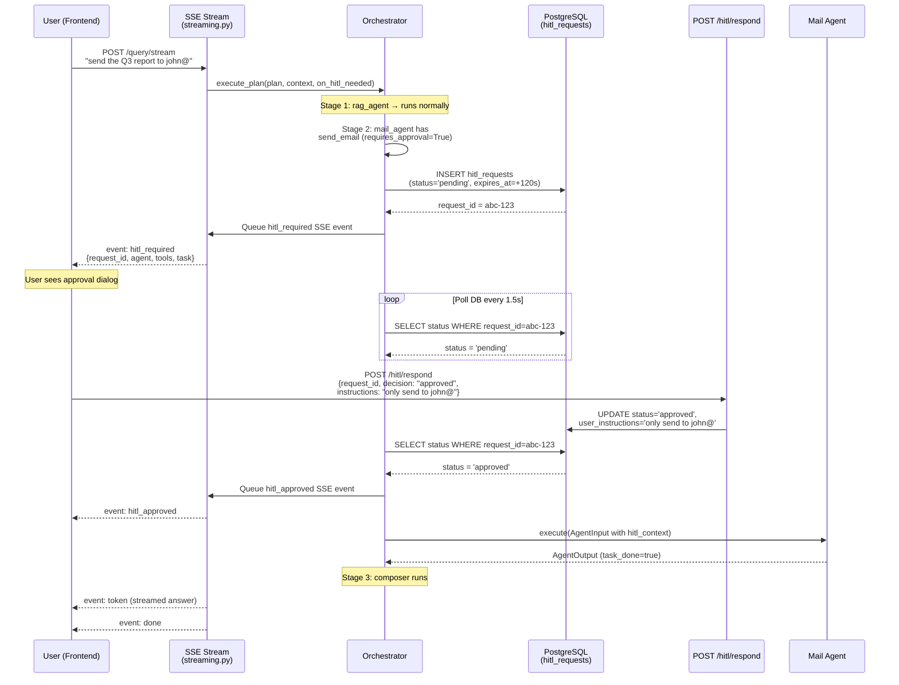
```mermaid
sequenceDiagram
    participant User as User (Frontend)
    participant SSE as SSE Stream<br/>(streaming.py)
    participant Orch as Orchestrator
    participant DB as PostgreSQL<br/>(hitl_requests)
    participant HITL as POST /hitl/respond
    participant Agent as Mail Agent

    User->>SSE: POST /query/stream<br/>"send the Q3 report to john@"
    SSE->>Orch: execute_plan(plan, context, on_hitl_needed)

    Note over Orch: Stage 1: rag_agent → runs normally

    Orch->>Orch: Stage 2: mail_agent has<br/>send_email (requires_approval=True)
    Orch->>DB: INSERT hitl_requests<br/>(status='pending', expires_at=+120s)
    DB-->>Orch: request_id = abc-123

    Orch->>SSE: Queue hitl_required SSE event
    SSE-->>User: event: hitl_required<br/>{request_id, agent, tools, task}

    Note over User: User sees approval dialog

    loop Poll DB every 1.5s
        Orch->>DB: SELECT status WHERE request_id=abc-123
        DB-->>Orch: status = 'pending'
    end

    User->>HITL: POST /hitl/respond<br/>{request_id, decision: "approved",<br/>instructions: "only send to john@"}
    HITL->>DB: UPDATE status='approved',<br/>user_instructions='only send to john@'

    Orch->>DB: SELECT status WHERE request_id=abc-123
    DB-->>Orch: status = 'approved'

    Orch->>SSE: Queue hitl_approved SSE event
    SSE-->>User: event: hitl_approved

    Orch->>Agent: execute(AgentInput with hitl_context)
    Agent-->>Orch: AgentOutput (task_done=true)

    Note over Orch: Stage 3: composer runs

    SSE-->>User: event: token (streamed answer)
    SSE-->>User: event: done
```

### What Happens When User Denies

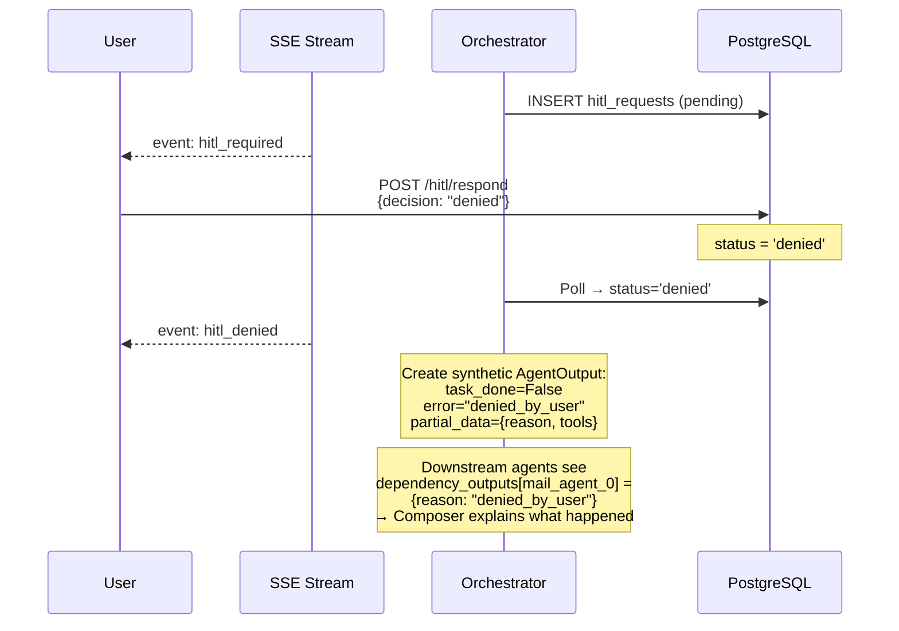
```mermaid
sequenceDiagram
    participant User as User
    participant SSE as SSE Stream
    participant Orch as Orchestrator
    participant DB as PostgreSQL

    Orch->>DB: INSERT hitl_requests (pending)
    SSE-->>User: event: hitl_required

    User->>DB: POST /hitl/respond<br/>{decision: "denied"}
    Note over DB: status = 'denied'

    Orch->>DB: Poll → status='denied'
    SSE-->>User: event: hitl_denied

    Note over Orch: Create synthetic AgentOutput:<br/>task_done=False<br/>error="denied_by_user"<br/>partial_data={reason, tools}

    Note over Orch: Downstream agents see<br/>dependency_outputs[mail_agent_0] =<br/>{reason: "denied_by_user"}<br/>→ Composer explains what happened
```

### What Happens on Timeout

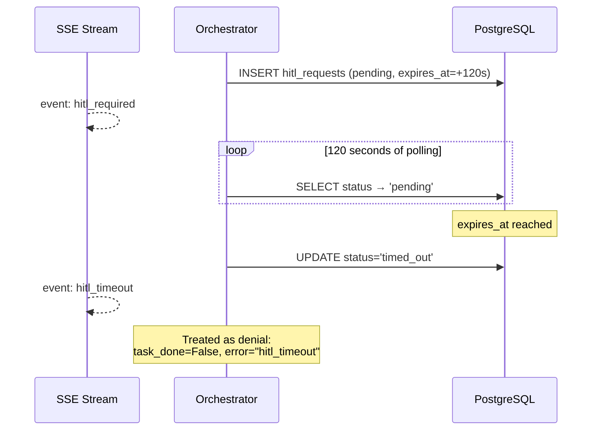
```mermaid
sequenceDiagram
    participant SSE as SSE Stream
    participant Orch as Orchestrator
    participant DB as PostgreSQL

    Orch->>DB: INSERT hitl_requests (pending, expires_at=+120s)
    SSE-->>SSE: event: hitl_required

    loop 120 seconds of polling
        Orch->>DB: SELECT status → 'pending'
    end

    Note over DB: expires_at reached

    Orch->>DB: UPDATE status='timed_out'
    SSE-->>SSE: event: hitl_timeout

    Note over Orch: Treated as denial:<br/>task_done=False, error="hitl_timeout"
```

### HITL Architecture — Internal Components

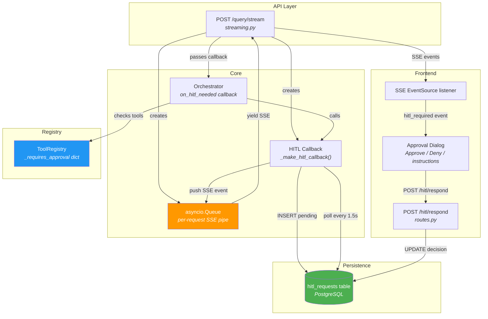
```mermaid
graph TD
    subgraph "Frontend"
        FE["SSE EventSource listener"]
        Dialog["Approval Dialog<br/><i>Approve / Deny / instructions</i>"]
        FE -->|"hitl_required event"| Dialog
        Dialog -->|"POST /hitl/respond"| HitlEndpoint
    end

    subgraph "API Layer"
        Stream["POST /query/stream<br/><i>streaming.py</i>"]
        HitlEndpoint["POST /hitl/respond<br/><i>routes.py</i>"]
    end

    subgraph "Core"
        Orch["Orchestrator<br/><i>on_hitl_needed callback</i>"]
        CB["HITL Callback<br/><i>_make_hitl_callback()</i>"]
        Queue["asyncio.Queue<br/><i>per-request SSE pipe</i>"]
    end

    subgraph "Persistence"
        DB[("hitl_requests table<br/><i>PostgreSQL</i>")]
    end

    subgraph "Registry"
        ToolReg["ToolRegistry<br/><i>_requires_approval dict</i>"]
    end

    Stream -->|"creates"| Queue
    Stream -->|"creates"| CB
    Stream -->|"passes callback"| Orch
    Orch -->|"checks tools"| ToolReg
    Orch -->|"calls"| CB
    CB -->|"INSERT pending"| DB
    CB -->|"push SSE event"| Queue
    CB -->|"poll every 1.5s"| DB
    HitlEndpoint -->|"UPDATE decision"| DB
    Queue -->|"yield SSE"| Stream
    Stream -->|"SSE events"| FE

    style DB fill:#4CAF50,color:#fff
    style Queue fill:#FF9800,color:#fff
    style ToolReg fill:#2196F3,color:#fff
```

### Parallel Agents + HITL

When a stage has both HITL and non-HITL agents, they run in parallel via `asyncio.gather`. The non-HITL agent executes immediately while the HITL agent blocks on DB polling:


```mermaid
gantt
    title Stage 2: mail_agent (HITL) + web_agent (no HITL)
    dateFormat X
    axisFormat %s

    section web_agent
    Execute normally           :done, 0, 3

    section mail_agent
    Wait for approval (polling DB) :active, 0, 8
    Execute after approval         :done, 8, 11

    section Stage 3
    Composer (waits for both)      :12, 15
```

---

### `hitl_requests` Database Table

| Column | Type | Description |
|--------|------|-------------|
| `request_id` | `UUID PK` | Unique identifier for this approval request |
| `conversation_id` | `UUID FK → conversations` | Links to the conversation that triggered this |
| `agent_id` | `TEXT` | Agent instance ID (e.g. `mail_agent_0`) |
| `agent_name` | `TEXT` | Agent type (e.g. `mail_agent`) |
| `tool_names` | `TEXT[]` | Tools requiring approval (e.g. `{send_email, reply_to_message}`) |
| `task_description` | `TEXT` | What the agent was asked to do |
| `status` | `VARCHAR(16)` | `pending` → `approved` / `denied` / `timed_out` / `expired` |
| `user_instructions` | `TEXT` | Optional instructions from user on approval |
| `created_at` | `TIMESTAMPTZ` | When the request was created |
| `responded_at` | `TIMESTAMPTZ` | When the user responded (NULL if pending) |
| `expires_at` | `TIMESTAMPTZ` | Auto-deny deadline (`created_at + timeout`) |

**Status lifecycle:**

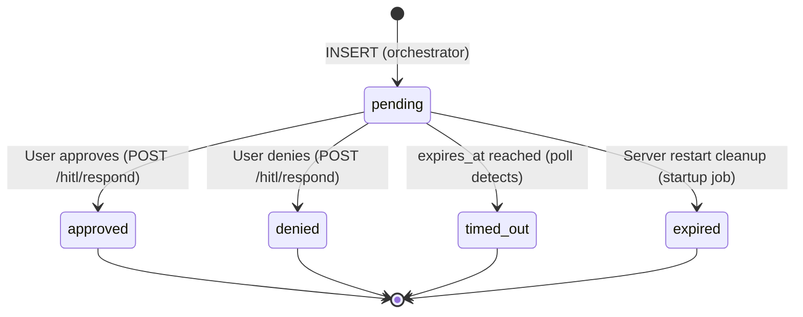
```mermaid
stateDiagram-v2
    [*] --> pending : INSERT (orchestrator)
    pending --> approved : User approves (POST /hitl/respond)
    pending --> denied : User denies (POST /hitl/respond)
    pending --> timed_out : expires_at reached (poll detects)
    pending --> expired : Server restart cleanup (startup job)

    approved --> [*]
    denied --> [*]
    timed_out --> [*]
    expired --> [*]
```

---

### SSE Event Types for HITL

| Event | When | Payload |
|-------|------|---------|
| `hitl_required` | Agent has HITL tools, approval needed | `{request_id, agent_id, agent_name, tool_names, task_description, timeout_seconds}` |
| `hitl_approved` | User approved the request | `{request_id, agent_id}` |
| `hitl_denied` | User denied the request | `{request_id, agent_id}` |
| `hitl_timeout` | Approval timed out | `{request_id, agent_id}` |

---

### Adding a New Agent with HITL Tools

Follow the standard ["Adding a New Agent"](#adding-a-new-agent-step-by-step) guide above, with these additions:

#### Step 1 — Mark tools with `requires_approval=True`

In `tools/<name>_tools.py`, add the flag to any tool that performs an irreversible action:

```python
from tools import tool

# Safe tool — no approval needed
@tool("deploy_agent")
async def check_deploy_status(deploy_id: str) -> Dict[str, Any]:
    """Read-only check — no HITL required."""
    ...

# Dangerous tool — requires user approval before the agent runs
@tool("deploy_agent", requires_approval=True)
async def trigger_deployment(service: str, version: str) -> Dict[str, Any]:
    """Deploys to production — user must approve first."""
    ...

# Another dangerous tool in the same agent
@tool("deploy_agent", requires_approval=True)
async def rollback_deployment(service: str) -> Dict[str, Any]:
    """Rolls back production — user must approve first."""
    ...
```

That's it. The `ToolRegistry` auto-discovers the flag at startup. When the Orchestrator sees that `deploy_agent`'s task includes `trigger_deployment` or `rollback_deployment`, it automatically triggers the HITL flow.

#### Step 2 — HITL instructions are auto-classified as **enhance** or **override** via `_effective_task()`

You do **not** need to manually check `hitl_context` in your agent. `BaseAgent` provides an async method `_effective_task(task_config)` that every agent should use when passing the task to prompts.

**How it works:**

When the user approves with additional instructions, `_effective_task()` calls a cheap LLM classifier (`gpt-4o-mini` by default) to determine the user's intent:

| Intent | Example | Behaviour |
|---|---|---|
| **enhance** | Original: "Search AI trends" → Instruction: "also include GPU growth" | Agent does **both** the original task AND the extra instruction |
| **override** | Original: "Search AI trends" → Instruction: "search about cricket instead" | Agent follows the instruction **instead of** the original task |

The classifier model is configurable via `HITL_CLASSIFIER_PROVIDER` and `HITL_CLASSIFIER_MODEL` in `.env`. Defaults: `openai` / `gpt-4o-mini`. If classification fails, it defaults to `enhance` (safe fallback — user gets both).

```python
# In agents/base_agent.py — already built in
async def _effective_task(self, task_config: AgentInput) -> str:
    # If no HITL instructions, returns task_config.task unchanged.
    # Otherwise:
    #   1. Calls _classify_hitl_intent() with a cheap LLM
    #   2. Returns a combined prompt (enhance) or replacement prompt (override)
```

**Usage in your agent — 2 lines:**

```python
# In agents/deploy_agent/agent.py
async def execute(self, task_config: AgentInput) -> AgentOutput:
    effective_task = await self._effective_task(task_config)  # ← line 1 (async!)

    prompt = self.prompts.deploy_prompt(
        task=effective_task,   # ← line 2: pass effective_task instead of task_config.task
        entities=task_config.entities,
        ...
    )

    # ... run tools, get result ...

    return AgentOutput(
        agent_id=task_config.agent_id,
        agent_name=self.agent_name,
        task_description=effective_task,  # ← IMPORTANT: use effective_task here too
        ...                               #    so the Composer knows the task was enhanced/overridden
    )
```

**What the LLM sees — enhance case:**

```
Complete BOTH the original task AND the additional user instructions below.

### Original Task
Search for AI trends in 2025

### User Enhanced Instructions
also include GPU market growth data
```

**What the LLM sees — override case:**

```
IMPORTANT — The user wants you to follow these override instructions
INSTEAD of the original task.

### User Override Instructions
search about cricket world cup instead

### Original Task (for reference only)
Search for AI trends in 2025
```

**What the LLM sees without HITL instructions:**

```
Deploy service-X version 2.3.1
```

> **Why `task_description=effective_task` in AgentOutput matters:**
> The Composer reads `task_description` from each agent's output. When it contains the HITL override marker, the Composer automatically detects it (via `_detect_hitl_overrides()`) and adds a notice to its own prompt: *"The user changed the task during approval. Present the data the agent actually returned, even if it differs from the Original User Query."*
> Without this, the Composer would see data that doesn't match the original query and say "I couldn't find that information."

#### Step 3 — Handle denial in prompts (optional)

If a downstream agent (e.g. `composer`) depends on a HITL agent that was denied, it receives `partial_data` with the denial reason in `dependency_outputs`. You can add prompt guidance:

```python
# In agents/composer/prompts.py  (or any downstream agent)
"""
If a dependency was denied by the user, explain what happened clearly:
- State which action was blocked
- Explain that it requires user approval
- Suggest the user try again via the streaming interface if they want to proceed
"""
```

#### No other changes needed

- **No orchestrator changes** — HITL pre-check is automatic for any tool with `requires_approval=True`
- **No streaming changes** — the callback + SSE events are generic
- **No route changes** — the `/hitl/respond` endpoint works for all agents
- **No DB changes** — the `hitl_requests` table is agent-agnostic
- **Adding/removing** — just toggle `requires_approval=True/False` on the `@tool` decorator

### Currently HITL-Protected Tools

| Tool | Agent | Why |
|------|-------|-----|
| `send_email` | `mail_agent` | Sends a real email via Gmail API |
| `reply_to_message` | `mail_agent` | Sends a real reply via Gmail API |
| `execute_code` | `code_agent` | Executes arbitrary Python code on the server |

### Non-Streaming Endpoint Behavior

The `POST /query` endpoint does **not** support HITL dialogs (no SSE connection for approval UI). When a query triggers an agent with HITL tools on the non-streaming endpoint:

- The agent is **auto-skipped** with `error="hitl_skipped_non_streaming"`
- `partial_data` explains: *"This agent requires human approval. Use the streaming endpoint."*
- The Composer includes this in the final answer so the user knows why
- Other non-HITL agents in the plan still execute normally

### Production Guarantees

| Concern | Solution |
|---------|----------|
| **Server restart mid-approval** | All HITL state is in PostgreSQL. SSE connection drops → client re-submits. Orphaned `pending` rows are cleaned up on startup (`expire_stale_hitl_requests()`). |
| **Multiple workers** | Worker A handles SSE stream + DB polling. Worker B handles `/hitl/respond` POST. Both hit the same DB. No cross-worker coordination needed. |
| **Late response (after timeout)** | `/hitl/respond` returns `409 Conflict` if the request is already resolved. |
| **Timeout** | Configurable via `HITL_TIMEOUT_SECONDS` env var (default 120s). Treated as denial. |
| **Parallel agents in same stage** | Non-HITL agents execute immediately. HITL agent polls DB. `asyncio.gather` waits for all. |
| **No in-memory state** | `asyncio.Queue` is per-request (dies with the SSE connection). All real state is in the `hitl_requests` table. |