# Multi-Agentic RAG System

A multi-agent Retrieval-Augmented Generation system built with FastAPI, Qdrant, PostgreSQL, and LLM providers (OpenAI / Anthropic). Agents are orchestrated via Kahn's topological sort, enabling parallel execution where dependencies allow and can handle any type of order execution of agents.Dynamic routing  of agents acording to query need.

### Dynamic routing of agents with TopoSort without using any frameworks like LangChain or LangGraph

### Frontend:
- http://127.0.0.1:8000/


- http://localhost:8080/dashboard.html  
```
run frontend/dashboard.py then open dashboard.html
```


### Backend:
- http://localhost:8000/docs#/


---

## System Architecture


---

## Memory Extraction Pipeline

Every user query passes through a **parallel memory extraction layer** that runs alongside the Master Agent — zero added latency. The extractor uses an LLM to detect personal data (name, company, job title, tone preferences, etc.) and persists any new findings to PostgreSQL for future conversations.


### What gets extracted

| Category | Fields | Example trigger |
|----------|--------|-----------------|
| **CriticalFacts** | `user_name`, `company_name`, `job_title`, `recent_projects` | *"I am Vinay working on RAG Project at Google"* |
| **UserPreferences** | `tone`, `detail_level`, `language` | *"Keep answers short and casual"* |

---

## Query Execution Patterns

The Master Agent produces an execution plan where agents can depend on each other. The Orchestrator uses **Kahn's topological sort** to group agents into parallel stages. Here are the three main patterns:

### 1. Parallel Execution (No Dependencies)

When agents are independent, they all run in **Stage 1** simultaneously.

> *Example: "Search my docs for Q3 revenue AND find the latest news about our competitor"*


**Dependency graph:**
```
RAG Agent  → (no depdends)  ─┐
                          ├─► Composer
Web Agent  → (no depdends)  ─┘
```

---

### 2. Sequential Execution (Linear Chain)

Each agent depends on the previous one's output, creating a strict pipeline.

> *Example: "Find sales data in my docs, write Python code to analyze the trend, then email the report to my manager"*


**Dependency graph:**
```
RAG Agent ──► Code Agent ──► Mail Agent ──► Composer
 (stage 1)    (stage 2)      (stage 3)
```

---

### 3. Diamond Execution (Fan-out + Fan-in)

Multiple agents run in parallel, then a downstream agent combines their results.

> *Example: "Search my docs for the budget, also find public benchmarks online, then write code to compare them"*


**Dependency graph:**
```
RAG Agent  ──┐
             ├──► Code Agent ──► Composer
Web Agent  ──┘
 (stage 1)      (stage 2)
```

---

### How Kahn's Algorithm Creates Stages


---

## RAG Document Pipeline — How Documents Are Processed

When a user uploads a document, it goes through this pipeline before it's searchable:


---

## RAG Query Pipeline — How Retrieval Works

When the RAG Agent receives a query, this is the retrieval + synthesis flow:


---

## Gmail Agent Flow


---

## Tavily Web Search Agent Flow


---

## Database Storage Reference

### PostgreSQL — Tables

| Table | Purpose | Key Columns |
|-------|---------|-------------|
| **`users`** | Registered users | `user_id` (UUID PK), `email`, `display_name`, `created_at`,`password`,`username` |
| **`sessions`** | Login/chat sessions | `session_id` (UUID PK), `user_id` (FK), `started_at`, `is_active` |
| **`conversations`** | Conversation threads within a session | `conversation_id` (UUID PK), `session_id` (FK), `user_id` (FK), `title` |
| **`messages`** | Individual messages in a conversation | `message_id` (UUID PK), `conversation_id` (FK), `role` (`user`/`assistant`/`system`), `content`, `metadata` (JSONB) |
| **`agent_executions`** | Audit log of every agent run | `execution_id` (UUID PK), `conversation_id` (FK), `agent_name`, `status` (`pending`/`running`/`success`/`failed`), `input_payload` (JSONB), `output_payload` (JSONB), `error_message` |
| **`documents`** | Uploaded document metadata | `doc_id` (UUID PK), `user_id` (FK), `filename`, `doc_type`, `total_chunks`, `qdrant_collection` |
| **`conversation_summaries`** | Rolling summaries of every 3 conversation turns | `summary_id` (UUID PK), `conversation_id` (FK), `summary_text`, `turns_covered` |
| **`user_long_term_memory`** | Persistent user profile extracted by the Memory Extractor | `user_id` (UUID PK), `critical_facts` (JSONB), `preferences` (JSONB), `updated_at` |
| **`hitl_requests`** | HITL approval requests for agents with dangerous tools | `request_id` (UUID PK), `conversation_id` (FK), `agent_id`, `agent_name`, `tool_names` (TEXT[]), `status` (`pending`/`approved`/`denied`/`timed_out`/`expired`), `user_instructions`, `expires_at` |
| **`user_connections`** | OAuth connections per user per provider | `connection_id` (UUID PK), `user_id` (FK), `provider` (VARCHAR), `account_label`, `account_id`, `access_token` (encrypted), `refresh_token` (encrypted), `expires_at`, `scopes` (TEXT[]), `provider_meta` (JSONB), `status` (`active`/`expired`/`error`/`revoked`) |

#### `user_long_term_memory` — JSONB Column Detail

```
critical_facts                          preferences
┌────────────────────────────────┐      ┌──────────────────────────┐
│ user_name    : "vinu"    │      │ tone         : "casual"  │
│ company_name : "Google"     │      │ detail_level : "detailed"│
│ job_title    : "AI Engineer" │      │ language     : "en"      │
│ recent_projects: ["RAGA",     │      └──────────────────────────┘
│                   "Beta"]      │
└────────────────────────────────┘
```

### Qdrant — Vector Collections

Each user gets a dedicated collection: **`user_{user_id}_documents`**

| Point Type | Stored Payload Fields | Purpose |
|------------|----------------------|---------|
| **`document_entry`** | `doc_id`, `filename`, `description`, `doc_type`, `uploaded_at`, `total_chunks` | Document-level vector for broad retrieval |
| **`chunk`** | `text`, `metadata` (`filename`, `page`, `section_title`, `doc_type`, `date`, …) | Individual text chunk for fine-grained search |

**Vector config:** `text-embedding-3-small` (1536 dimensions), cosine distance.

**Payload indexes:** `metadata.doc_type` (keyword), `metadata.date` (keyword), `metadata.section_title` (text).

---

## Agent Input / Output Reference

Every agent receives an **`AgentInput`** and returns an **`AgentOutput`**. These are Pydantic models defined in `utils/schemas.py`.

### Common Input — `AgentInput`

| Field | Type | Description |
|-------|------|-------------|
| `agent_id` | `str` | Unique instance ID (e.g. `rag_agent-a1b2c3`) |
| `agent_name` | `str` | Agent type (`rag_agent`, `code_agent`, …) |
| `task` | `str` | Natural-language task description from the Master Agent |
| `entities` | `Dict` | Extracted entities (`date_range`, `metric`, `names`, `doc_type`, …) |
| `tools` | `List[str]` | Tools this agent is allowed to use |
| `conversation_history` | `List[Dict]` | Recent conversation context |
| `long_term_memory` | `Dict` | `{critical: {...}, preferences: {...}}` — user profile |
| `dependency_outputs` | `Dict` | Outputs from upstream agents (`dep_agent_id → data`) |
| `retry_config` | `Dict` | `{max_retries, timeout, backoff_multiplier}` |
| `metadata` | `Dict` | `{user_id, query_id, session_id}` |

### Common Output — `AgentOutput`

| Field | Type | Description |
|-------|------|-------------|
| `agent_id` | `str` | Same ID from input |
| `agent_name` | `str` | Agent type |
| `task_description` | `str` | What was asked |
| `task_done` | `bool` | `true` on success, `false` on failure/timeout |
| `data` | `Dict` | Full results (agent-specific, see below) |
| `partial_data` | `Dict` | Partial results on timeout/failure |
| `error` | `str` | Error message if failed |
| `confidence_score` | `float` | 0.0 – 1.0 |
| `depends_on` | `List[str]` | IDs of upstream agents this depended on |
| `resource_usage` | `Dict` | `{time_taken_ms, tokens_used, api_calls_made, …}` |
| `metadata` | `Dict` | `{sources, citations, model_used}` |

### Per-Agent `data` Output

#### RAG Agent

```json
{
  "chunks": [
    {"chunk_id": "uuid", "score": 0.92, "text": "...", "metadata": {"filename": "report.pdf", "page": 3, "section_title": "Revenue"}}
  ],
  "sources": [
    {"type": "document", "source": "report.pdf", "page": 3, "section": "Revenue"}
  ],
  "query": "What was Q3 revenue?"
}
```

| Key | Description |
|-----|-------------|
| `chunks` | Top-8 reranked document chunks with text, score, and metadata |
| `sources` | Deduplicated list of source documents cited |
| `query` | The original search query |

#### Code Agent

```json
{
  "code": "import json\ndata = {...}\nprint(json.dumps(data, indent=2))",
  "stdout": "{\"total\": 42}",
  "stderr": "",
  "exit_code": 0
}
```

| Key | Description |
|-----|-------------|
| `code` | The generated Python code |
| `stdout` | Standard output from execution |
| `stderr` | Standard error (if any) |
| `exit_code` | `0` = success, non-zero = failure |

#### Mail Agent

```json
{
  "action": "search_inbox",
  "messages": [
    {"id": "msg-id", "from": "bob@example.com", "subject": "Q3 Report", "date": "2026-01-15", "snippet": "..."}
  ],
  "count": 5
}
```

| Action | Extra `data` keys | Description |
|--------|-------------------|-------------|
| `search_inbox` / `search_sent` | `messages`, `count` | List of matching messages |
| `search_drafts` | `drafts`, `count` | List of matching drafts |
| `read` | `message` | Full message content |
| `send` | `sent` | Confirmation + message ID |
| `draft` | `draft` | Created draft details |
| `reply` | `reply` | Reply confirmation |

Also returns a `result` field with an LLM-generated human-readable summary.

#### Web Search Agent

```json
{
  "search_query": "Python async best practices 2026",
  "search_type": "basic",
  "tavily_answer": "Short AI-generated answer from Tavily...",
  "search_results": [
    {"title": "...", "url": "https://...", "snippet": "...", "score": 0.95}
  ],
  "fetched_pages": 2,
  "sources": [
    {"type": "web", "source": "Article Title", "url": "https://...", "excerpt": "...", "relevance_score": 0.95}
  ]
}
```

| Key | Description |
|-----|-------------|
| `search_query` | The optimised query sent to Tavily |
| `search_type` | `basic`, `news`, or `deep` |
| `tavily_answer` | Tavily's AI-generated direct answer (if available) |
| `search_results` | Raw results with title, URL, snippet, score |
| `fetched_pages` | Number of pages deep-fetched for richer content |
| `sources` | Formatted source list for citations |

Also returns a `result` field with the LLM-synthesised final answer.

### Master Agent → Composer Pipeline

```
User Query
    │
    ▼
┌────────────┐   ResolvedMasterOutput    ┌──────────────┐
│ Master     │ ────────────────────────▶ │ Orchestrator │
│ Agent      │   • analysis.intent       │              │
│            │   • analysis.entities     │  runs agents │
│            │   • execution_plan        │  in stages   │
└────────────┘     (agent tasks +        └──────┬───────┘
                    dependencies)                │
                                                 ▼
                                     Dict[agent_id → AgentOutput]
                                                 │
                                                 ▼
                                         ┌──────────────┐   ComposerOutput
                                         │  Composer    │ ──────────────▶ User
                                         │  Agent       │   • answer (str)
                                         │              │   • sources
                                         └──────────────┘
```

---

## Auth & Connectors Architecture

The system uses a modular architecture for authentication and third-party OAuth integrations.

### Project Structure

```
MRAG/
├── auth/                            # User authentication module
│   ├── __init__.py
│   ├── routes.py                    # POST /register, /login
│   ├── jwt.py                       # JWT create/verify (HMAC-SHA256)
│   ├── models.py                    # User ORM (re-exports from database/models.py)
│   ├── dependencies.py              # get_current_user_id() FastAPI dependency
│   └── password.py                  # bcrypt hash/verify
│
├── connectors/                      # OAuth connector module
│   ├── __init__.py
│   ├── routes.py                    # /providers, /auth-url, /callback, /connections
│   ├── base.py                      # BaseConnector abstract class
│   ├── gmail.py                     # GmailConnector(BaseConnector)
│   ├── models.py                    # UserConnection ORM (re-exports from database/models.py)
│   ├── registry.py                  # ConnectorRegistry (auto-discover at startup)
│   ├── token_manager.py             # get/store/refresh/revoke per-user tokens
│   └── encryption.py                # Fernet AES encryption for tokens at rest
│
├── api/                             # AI routes (unchanged)
│   ├── routes.py                    # /query, /hitl/respond
│   ├── streaming.py                 # /query/stream (SSE)
│   └── middleware.py
│
├── agents/                          # Agent implementations
├── core/                            # Orchestrator, Master, Composer
├── tools/                           # Tool functions (mail_tools uses connectors)
└── ...
```

### Security Configuration

All secrets are loaded from environment variables via `config/settings.py`:

| Env Var | Purpose | Generate with |
|---------|---------|---------------|
| `JWT_SECRET` | HMAC-SHA256 signing key for auth tokens | `python -c "import secrets; print(secrets.token_urlsafe(48))"` |
| `JWT_EXPIRY_SECONDS` | Token TTL (default: 604800 = 7 days) | — |
| `OAUTH_STATE_SECRET` | HMAC key for OAuth CSRF state tokens | `python -c "import secrets; print(secrets.token_urlsafe(48))"` |
| `TOKEN_ENCRYPTION_KEY` | Fernet key for encrypting OAuth tokens at rest | `python -c "from cryptography.fernet import Fernet; print(Fernet.generate_key().decode())"` |

#### Password Hashing

Passwords are hashed with **bcrypt** (work factor 12, auto-salted):

```python
# auth/password.py
from auth.password import hash_password, verify_password

hashed = hash_password("user-password")       # $2b$12$...
ok     = verify_password("user-password", hashed)  # True
```

#### Token Encryption at Rest

OAuth access tokens and refresh tokens are encrypted with **Fernet (AES-128-CBC + HMAC-SHA256)** before being stored in PostgreSQL. This is handled transparently by `connectors/encryption.py`:

```
Store flow:   plaintext_token → encrypt_token() → ciphertext → DB column
Read flow:    DB column → ciphertext → decrypt_token() → plaintext_token
```

- If `TOKEN_ENCRYPTION_KEY` is not set, tokens are stored as plaintext (with a warning)
- Tokens stored before encryption was enabled are handled gracefully (auto-detected and returned as-is)
- All encryption/decryption is done inside `token_manager.py` — no other code needs to know about it

### OAuth Connector Flow


### How Tools Use Connector Tokens

When the Mail Agent runs, it needs a Gmail API token. The flow is:

```
mail_agent.execute()
  → sets current_user_id ContextVar
  → calls get_gmail_service_async(user_id)
    → calls token_manager.get_active_token(user_id, "gmail")
      → SELECT from user_connections WHERE user_id + provider
      → decrypt_token(access_token)
      → if expired: refresh via connector.refresh_access_token()
      → return plaintext access_token
    → builds Gmail API service object
  → tools use the authenticated service
```

No tool function signatures change. The `current_user_id` ContextVar bridges the user context to per-user tokens.

---

## How to Add a New Connector

Adding a new OAuth connector (Slack, Notion, GitHub, etc.) is a **5-step process**. Below is a complete walkthrough using **Slack** as the example, including HITL-protected tools.

### Overview

```
┌─────────────────────────────────────────────────────────────────────┐
│  Step 1 │ connectors/slack.py         — implement SlackConnector   │
│  Step 2 │ connectors/registry.py      — register the connector     │
│  Step 3 │ config/settings.py + .env   — add client_id / secret     │
│  Step 4 │ tools/slack_tools.py        — implement tool functions   │
│  Step 5 │ agents/slack_agent/         — agent.py + prompts.py      │
│  Step 6 │ config/agent_registry.yaml  — register agent             │
│  Step 7 │ core/agent_factory.py        — wire agent instance       │
└─────────────────────────────────────────────────────────────────────┘
```

---

### Step 1 — Create the Connector

Create `connectors/slack.py` — subclass `BaseConnector` and implement the four OAuth methods:

```python
# connectors/slack.py

"""SlackConnector — OAuth2 for Slack workspace access."""

from __future__ import annotations

import logging
from typing import Any, Dict, List
from urllib.parse import urlencode

import httpx

from config.settings import config
from connectors.base import BaseConnector

logger = logging.getLogger(__name__)

_SLACK_AUTH_URL = "https://slack.com/oauth/v2/authorize"
_SLACK_TOKEN_URL = "https://slack.com/api/oauth.v2.access"
_SLACK_REVOKE_URL = "https://slack.com/api/auth.revoke"


class SlackConnector(BaseConnector):

    @property
    def provider_name(self) -> str:
        return "slack"

    @property
    def display_name(self) -> str:
        return "Slack"

    @property
    def scopes(self) -> List[str]:
        return [
            "channels:read",
            "channels:history",
            "chat:write",
            "users:read",
        ]

    @property
    def icon(self) -> str:
        return "💬"

    def is_configured(self) -> bool:
        return bool(config.slack_client_id and config.slack_client_secret)

    def _redirect_uri(self) -> str:
        return f"{config.oauth_redirect_base}/api/v1/connectors/slack/callback"

    def get_auth_url(self, state: str) -> str:
        params = {
            "client_id": config.slack_client_id,
            "redirect_uri": self._redirect_uri(),
            "scope": ",".join(self.scopes),
            "state": state,
        }
        return f"{_SLACK_AUTH_URL}?{urlencode(params)}"

    async def handle_callback(self, code: str) -> Dict[str, Any]:
        async with httpx.AsyncClient() as client:
            resp = await client.post(
                _SLACK_TOKEN_URL,
                data={
                    "code": code,
                    "client_id": config.slack_client_id,
                    "client_secret": config.slack_client_secret,
                    "redirect_uri": self._redirect_uri(),
                },
            )
            resp.raise_for_status()
            data = resp.json()

            if not data.get("ok"):
                raise ValueError(f"Slack OAuth error: {data.get('error')}")

        return {
            "access_token": data["access_token"],
            "refresh_token": data.get("refresh_token"),
            "expires_in": data.get("expires_in", 43200),  # 12h default
            "scopes": data.get("scope", "").split(","),
            "account_id": data.get("team", {}).get("id", ""),
            "account_label": data.get("team", {}).get("name", "Slack Workspace"),
            "provider_meta": {
                "team_id": data.get("team", {}).get("id"),
                "team_name": data.get("team", {}).get("name"),
                "bot_user_id": data.get("bot_user_id"),
            },
        }

    async def refresh_access_token(self, refresh_token: str) -> Dict[str, Any]:
        # Slack V2 tokens don't always support refresh — depends on app type
        # For token rotation apps, implement refresh here
        raise NotImplementedError("Slack token refresh not supported for this app type")

    async def revoke_token(self, access_token: str) -> bool:
        try:
            async with httpx.AsyncClient() as client:
                resp = await client.post(
                    _SLACK_REVOKE_URL,
                    headers={"Authorization": f"Bearer {access_token}"},
                )
                data = resp.json()
                return data.get("ok", False)
        except Exception:
            return False
```

**Key rules:**
- `provider_name` must be a unique slug — used in URLs (`/connectors/slack/callback`)
- `is_configured()` gates registration — connector is skipped if credentials are missing
- `handle_callback()` must return the standardised dict with `access_token`, `refresh_token`, `scopes`, `account_id`, `account_label`, `provider_meta`
- All HTTP calls use `httpx.AsyncClient` (async-compatible)

---

### Step 2 — Register in ConnectorRegistry

Add the import and instance to the `_ALL_CONNECTORS` list in `connectors/registry.py`:

```python
# connectors/registry.py

from connectors.slack import SlackConnector

_ALL_CONNECTORS: List[BaseConnector] = [
    GmailConnector(),
    SlackConnector(),      # ← add here
    # NotionConnector(),   # future
]
```

That's all — the registry auto-discovers configured connectors at startup and logs a warning for unconfigured ones.

---

### Step 3 — Add Config

Add credentials to `config/settings.py`:

```python
# config/settings.py — inside class Settings:

    slack_client_id: str = ""
    slack_client_secret: str = ""
```

Add env vars to `.env`:

```env
# ── Slack OAuth ──────────────────────────────────────
# 1. Go to https://api.slack.com/apps → Create New App
# 2. OAuth & Permissions → Add redirect URL:
#    http://localhost:8000/api/v1/connectors/slack/callback
# 3. Copy Client ID and Client Secret below
SLACK_CLIENT_ID=
SLACK_CLIENT_SECRET=
```

---

### Step 4 — Create Tool Functions with HITL

Create `tools/slack_tools.py`. Some tools are read-only (safe), others send messages (irreversible → `requires_approval=True`):

```python
# tools/slack_tools.py

"""Slack tools — registered via @tool decorator."""

from __future__ import annotations

import logging
from typing import Any, Dict, List

import httpx

from tools import tool

logger = logging.getLogger(__name__)

_SLACK_API = "https://slack.com/api"


async def _slack_api(token: str, method: str, **kwargs) -> Dict[str, Any]:
    """Helper — call a Slack Web API method."""
    async with httpx.AsyncClient() as client:
        resp = await client.post(
            f"{_SLACK_API}/{method}",
            headers={"Authorization": f"Bearer {token}"},
            json=kwargs,
        )
        resp.raise_for_status()
        data = resp.json()
        if not data.get("ok"):
            raise ValueError(f"Slack API error: {data.get('error')}")
        return data


# ── Safe tools (no approval needed) ────────────────────────────────────


@tool("slack_agent")
async def list_channels(token: str) -> List[Dict[str, Any]]:
    """List public channels in the workspace."""
    data = await _slack_api(token, "conversations.list", types="public_channel", limit=100)
    return [
        {"id": ch["id"], "name": ch["name"], "topic": ch.get("topic", {}).get("value", "")}
        for ch in data.get("channels", [])
    ]


@tool("slack_agent")
async def read_channel_history(
    token: str,
    channel_id: str,
    limit: int = 20,
) -> List[Dict[str, Any]]:
    """Read recent messages from a channel."""
    data = await _slack_api(token, "conversations.history", channel=channel_id, limit=limit)
    return [
        {"user": m.get("user", ""), "text": m.get("text", ""), "ts": m.get("ts", "")}
        for m in data.get("messages", [])
    ]


@tool("slack_agent")
async def search_messages(
    token: str,
    query: str,
    count: int = 10,
) -> List[Dict[str, Any]]:
    """Search messages across the workspace."""
    data = await _slack_api(token, "search.messages", query=query, count=count)
    matches = data.get("messages", {}).get("matches", [])
    return [
        {
            "channel": m.get("channel", {}).get("name", ""),
            "user": m.get("username", ""),
            "text": m.get("text", ""),
            "ts": m.get("ts", ""),
            "permalink": m.get("permalink", ""),
        }
        for m in matches
    ]


# ── Dangerous tools (requires HITL approval) ──────────────────────────


@tool("slack_agent", requires_approval=True)
async def send_message(
    token: str,
    channel_id: str,
    text: str,
) -> Dict[str, Any]:
    """
    Send a message to a Slack channel.
    ⚠️ Requires user approval — this posts a real message visible to everyone.
    """
    data = await _slack_api(token, "chat.postMessage", channel=channel_id, text=text)
    return {
        "channel": data.get("channel", ""),
        "ts": data.get("ts", ""),
        "message": data.get("message", {}).get("text", ""),
    }


@tool("slack_agent", requires_approval=True)
async def send_dm(
    token: str,
    user_id: str,
    text: str,
) -> Dict[str, Any]:
    """
    Send a direct message to a user.
    ⚠️ Requires user approval — this sends a real DM.
    """
    # Open DM channel first
    dm = await _slack_api(token, "conversations.open", users=user_id)
    channel_id = dm["channel"]["id"]
    data = await _slack_api(token, "chat.postMessage", channel=channel_id, text=text)
    return {
        "channel": channel_id,
        "ts": data.get("ts", ""),
        "message": text,
    }
```

**Key points:**
- `@tool("slack_agent")` — safe, read-only tools: `list_channels`, `read_channel_history`, `search_messages`
- `@tool("slack_agent", requires_approval=True)` — irreversible tools: `send_message`, `send_dm`
- The HITL system auto-detects tools with `requires_approval=True` at startup — no orchestrator changes needed
- When the user queries "send a message to #general", the Orchestrator sees `send_message` requires approval → triggers the HITL dialog → the user approves or denies → only then does the agent execute

---

### Step 5 — Create the Agent

Create `agents/slack_agent/` with `__init__.py`, `prompts.py`, and `agent.py`:

#### `agents/slack_agent/prompts.py`

```python
# agents/slack_agent/prompts.py

from __future__ import annotations
from typing import Any, Dict

from utils.prompt_utils import format_user_profile


class SlackPrompts:

    @staticmethod
    def action_prompt(
        task: str,
        entities: Dict[str, Any],
        dependency_outputs: Dict[str, Any] | None = None,
        long_term_memory: Dict[str, Any] | None = None,
    ) -> str:
        dep_context = ""
        if dependency_outputs:
            dep_context = "\n### Context from other agents\n"
            for aid, data in dependency_outputs.items():
                dep_context += f"- **{aid}**: {str(data)[:500]}\n"

        profile = format_user_profile(long_term_memory or {})

        return f"""You are a Slack Integration Agent in a multi-agent system.

### Task
{task}
{dep_context}
{profile}
### Available Actions
- list_channels       — list workspace channels
- read_channel_history — read recent messages from a channel
- search_messages      — search across the workspace
- send_message         — post a message to a channel (⚠️ requires approval)
- send_dm              — send a direct message (⚠️ requires approval)

### Instructions
1. Determine the best action(s) to fulfil the task.
2. For read operations, gather information first, then summarise.
3. For send operations, compose a professional message matching the user's tone preferences.
4. Always confirm what was done in your response.
"""
```

#### `agents/slack_agent/agent.py`

```python
# agents/slack_agent/agent.py

from __future__ import annotations

import time
from typing import Any, Dict, List
from contextvars import ContextVar

from agents.base_agent import BaseAgent
from agents.slack_agent.prompts import SlackPrompts
from config.settings import config
from utils.schemas import AgentInput, AgentOutput

# Same ContextVar pattern as mail_agent — bridges user_id to tools
current_user_id: ContextVar[str] = ContextVar("current_user_id", default="")


class SlackAgent(BaseAgent):
    def __init__(self, tool_registry, llm_provider):
        super().__init__("slack_agent", tool_registry)
        self.llm = llm_provider
        self.prompts = SlackPrompts()

    def get_required_tools(self) -> List[str]:
        return ["list_channels", "read_channel_history", "search_messages",
                "send_message", "send_dm"]

    async def execute(self, task_config: AgentInput) -> AgentOutput:
        start = time.perf_counter()

        # Set user context for per-user token retrieval
        user_id = task_config.metadata.get("user_id", "")
        current_user_id.set(user_id)

        # Get per-user Slack token via connectors
        from connectors.token_manager import get_active_token
        token = await get_active_token(user_id, "slack")
        if not token:
            return AgentOutput(
                agent_id=task_config.agent_id,
                agent_name=self.agent_name,
                task_description=task_config.task,
                task_done=False,
                error="Slack not connected. Please connect Slack via the Connections panel.",
                data={},
            )

        try:
            # Use HITL-aware effective task
            effective_task = await self._effective_task(task_config)

            prompt = self.prompts.action_prompt(
                task=effective_task,
                entities=task_config.entities,
                dependency_outputs=task_config.dependency_outputs,
                long_term_memory=task_config.long_term_memory,
            )

            # LLM decides which tool(s) to call and composes the response
            result = await self.llm.generate(
                prompt=prompt,
                temperature=config.get_agent_model_config("slack_agent")["temperature"],
                model=config.get_agent_model_config("slack_agent")["model"],
            )

            return AgentOutput(
                agent_id=task_config.agent_id,
                agent_name=self.agent_name,
                task_description=effective_task,
                task_done=True,
                result=result,
                data={"result": result},
                confidence_score=0.85,
                resource_usage={
                    "time_taken_ms": int((time.perf_counter() - start) * 1000),
                },
                depends_on=list(task_config.dependency_outputs.keys()),
            )
        except Exception:
            raise  # Let execute_with_retry handle retries
```

---

### Step 6 — Register the Agent

Follow the standard agent registration in `config/agent_registry.yaml`:

```yaml
  slack_agent:
    description: "Interacts with Slack — read channels, search messages, send messages"
    capabilities:
      - slack_read
      - slack_search
      - slack_send
    tools:
      - list_channels
      - read_channel_history
      - search_messages
      - send_message
      - send_dm
    typical_use_cases:
      - "Search Slack for messages about deployment"
      - "Send a message to #general"
      - "Read the latest messages in #engineering"
    default_timeout: 30
    max_retries: 2
```

And add model config to `config/settings.py`:

```python
    slack_model_provider: str = "openai"
    slack_model: str = "gpt-4o-mini"
    slack_temperature: float = 0.3
```

---

### Step 7 — Wire the Agent Instance

All agents are built centrally in `core/agent_factory.py`. Add your agent to the `build_agent_instances()` function — `api/routes.py` and `api/streaming.py` both call this function automatically, so you do **not** touch them:

```python
# core/agent_factory.py

from agents.slack_agent.agent import SlackAgent

def build_agent_instances(registry: ToolRegistry) -> Dict[str, BaseAgent]:
    # ... existing agents ...
    slack_cfg = config.get_agent_model_config("slack_agent")

    return {
        # ... existing agents ...
        "slack_agent": SlackAgent(
            tool_registry=registry,
            llm_provider=get_llm_provider(slack_cfg["provider"], default_model=slack_cfg["model"]),
        ),
    }
```

### What Happens at Runtime

When a user asks "Send a summary of today's deployments to #general on Slack":

1. **Master Agent** routes to `slack_agent` (capabilities match `slack_send`)
2. **Orchestrator** checks `slack_agent`'s tools → finds `send_message` has `requires_approval=True`
3. **HITL flow triggers** → SSE event `hitl_required` sent to frontend
4. **User sees dialog**: "slack_agent wants to use `send_message`. Approve?"
5. **User approves** (optionally adds instructions like "add a 🚀 emoji")
6. **`_effective_task()`** classifies instructions as `enhance` → agent gets both tasks
7. **Agent executes** → calls `get_active_token("slack")` → gets per-user token → calls Slack API
8. **Composer** synthesises the final answer with what was sent

### Checklist

| # | File | Action |
|---|------|--------|
| 1 | `connectors/slack.py` | `SlackConnector(BaseConnector)` with OAuth flow |
| 2 | `connectors/registry.py` | Add `SlackConnector()` to `_ALL_CONNECTORS` |
| 3 | `config/settings.py` + `.env` | Add `slack_client_id`, `slack_client_secret`, model config |
| 4 | `tools/slack_tools.py` | `@tool("slack_agent")` and `@tool("slack_agent", requires_approval=True)` |
| 5 | `agents/slack_agent/` | `prompts.py` + `agent.py` (uses `_effective_task()` for HITL) |
| 6 | `config/agent_registry.yaml` | Register capabilities, tools, use cases |
| 7 | `core/agent_factory.py` | Add `SlackAgent` to `build_agent_instances()` return dict |

### What You Get for Free

- **OAuth UI** — "Connect Slack" button appears automatically in the frontend sidebar (the connector routes serve it)
- **Token management** — auto-refresh, encryption at rest, revocation on disconnect
- **HITL approval** — any tool with `requires_approval=True` triggers the approval dialog
- **HITL instructions** — user can add "change the tone" or "don't include X" during approval, auto-classified as enhance/override
- **Dashboard** — `user_connections` table shows all Slack connections in the admin dashboard
- **No orchestrator changes** — HITL, toposort, parallel stages all work identically

---

## Quick Start

```bash
cp .env.example .env
docker compose up -d postgres qdrant
uv sync
.venv\Scripts\activate
pip install -r requirements.txt
uv run uvicorn main:app --reload
```
---

## How to Add a New Agent

Adding a new agent is a **7-step process** touching 6 files (3 new, 3 existing). Below is a complete walkthrough using a fictional **`summary_agent`** as the example.

### Overview

```
┌─────────────────────────────────────────────────────────────────────┐
│  Step 1 │ config/agent_registry.yaml  — register capabilities      │
│  Step 2 │ config/settings.py          — add model/temp settings    │
│  Step 3 │ .env                        — set model env vars         │
│  Step 4 │ tools/summary_tools.py      — implement tool functions   │
│  Step 5 │ agents/summary_agent/       — prompts.py + agent.py      │
│  Step 6 │ core/agent_factory.py        — inject agent instance     │
│  Step 7 │ tests/                      — add agent tests   # Optional         │
└─────────────────────────────────────────────────────────────────────┘
```

---

### Step 1 — Register in `config/agent_registry.yaml`

The Master Agent reads this file to know what agents exist and when to select them. Append a new block:

```yaml
# config/agent_registry.yaml

agents:
  # ... existing agents ...

  summary_agent:
    description: "Generates concise summaries of long-form text, documents, or agent outputs"
    capabilities:
      - text_summarisation
      - key_point_extraction
      - executive_briefing
    tools:
      - summarise_text        # must match @tool function names in Step 4
      - extract_key_points
    typical_use_cases:
      - "Summarise this document in 3 bullet points"
      - "Give me an executive brief of last quarter's report"
      - "Condense these search results into a paragraph"
    default_timeout: 30
    max_retries: 2
```

**Key rules:**
- `capabilities` drives Master Agent's selection logic (what the agent *can* do)
- `tools` must exactly match the function names decorated with `@tool` in Step 4
- `typical_use_cases` are injected into the Master Agent prompt so it knows *when* to select this agent

---

### Step 2 — Add Model Settings in `config/settings.py`

Each agent gets its own model/provider/temperature triple:

```python
# config/settings.py — inside class Settings(BaseSettings):

    # ── Summary Agent Model ─────────────────────────────────────────────
    summary_model_provider: str = "openai"
    summary_model: str = "gpt-4o-mini"
    summary_temperature: float = 0.3
```

Then add the mapping in `get_agent_model_config()`:

```python
    mapping = {
        # ... existing agents ...
        "summary_agent": (self.summary_model_provider, self.summary_model, self.summary_temperature),
    }
```

---

### Step 3 — Add Env Vars to `.env` / `.env.example`

```env
# Summary Agent
SUMMARY_MODEL_PROVIDER=openai
SUMMARY_MODEL=gpt-4o-mini
SUMMARY_TEMPERATURE=0.3
```

---

### Step 4 — Create Tool Functions in `tools/summary_tools.py`

Every tool is a standalone async function decorated with `@tool("agent_name")`. The decorator declares which agents may call it.

```python
# tools/summary_tools.py

"""Summary tools — registered via @tool decorator."""

from __future__ import annotations
from typing import Any, Dict, List
from tools import tool


@tool("summary_agent")
async def summarise_text(
    text: str,
    max_length: int = 500,
    style: str = "bullet_points",
) -> Dict[str, Any]:
    """
    Summarise the given text.

    Parameters
    ----------
    text        : the content to summarise
    max_length  : target summary length (chars)
    style       : "bullet_points" | "paragraph" | "executive"
    """
    # Your implementation here — call an LLM, use a library, etc.
    # Return a dict consumable by the agent.
    return {
        "summary": "...",
        "word_count": 0,
        "style": style,
    }


@tool("summary_agent")
async def extract_key_points(
    text: str,
    num_points: int = 5,
) -> List[str]:
    """Extract the top-N key points from the text."""
    return ["point 1", "point 2"]
```

**Key rules:**
- File must be named `*_tools.py` inside `tools/` — the `ToolRegistry.auto_discover_tools()` scans `tools/*_tools.py` automatically.
- The `@tool("summary_agent")` string must match the agent name in `agent_registry.yaml`.
- Multiple agents can share a tool: `@tool("summary_agent", "rag_agent")`.

---

### Step 5 — Create the Agent Package

Create a folder `agents/summary_agent/` with three files:

#### 5a. `agents/summary_agent/__init__.py`

```python
# empty — makes it a package
```

#### 5b. `agents/summary_agent/prompts.py`

Every prompt class follows the same pattern: static methods that accept task data + `long_term_memory` and return a formatted prompt string. Use the shared `format_user_profile()` from `utils/prompt_utils.py` — **do not** duplicate it in your prompt class.

```python
# agents/summary_agent/prompts.py

"""Summary agent prompts — production-quality, personalised."""

from __future__ import annotations
from typing import Any, Dict

from utils.prompt_utils import format_user_profile


class SummaryPrompts:

    @staticmethod
    def summarise_prompt(
        task: str,
        source_text: str,
        entities: Dict[str, Any],
        dependency_outputs: Dict[str, Any] | None = None,
        long_term_memory: Dict[str, Any] | None = None,
    ) -> str:
        dep_context = ""
        if dependency_outputs:
            dep_context = "\n### Context from other agents\n"
            for aid, data in dependency_outputs.items():
                dep_context += f"- **{aid}**: {str(data)[:500]}\n"

        entity_str = (
            ", ".join(f"{k}={v}" for k, v in entities.items())
            if entities else "none"
        )

        profile = format_user_profile(long_term_memory or {})

        return f"""You are a Summarisation Expert in a multi-agent RAG system.

### Task
{task}

### Entities
{entity_str}
{dep_context}
{profile}
### Source Text
{source_text[:5000]}

### Instructions
1. Produce a clear, accurate summary that captures the key information.
2. Match the user's preferred detail level and tone from the User Profile.
3. Respond in the user's preferred language if specified.
4. Cite specific facts, figures, and dates from the source.

### Summary"""
```

#### 5c. `agents/summary_agent/agent.py`

Inherit from `BaseAgent`, implement `execute()` and `get_required_tools()`.

```python
# agents/summary_agent/agent.py

"""Summary Agent — generates summaries from documents or upstream agent data."""

from __future__ import annotations

import time
from typing import Any, Dict, List

from agents.base_agent import BaseAgent
from agents.summary_agent.prompts import SummaryPrompts
from config.settings import config
from utils.schemas import AgentInput, AgentOutput


class SummaryAgent(BaseAgent):
    def __init__(self, tool_registry, llm_provider):
        super().__init__("summary_agent", tool_registry)   # ← must match registry key
        self.llm = llm_provider
        self.prompts = SummaryPrompts()

    def get_required_tools(self) -> List[str]:
        """Declare tools this agent needs (validated at startup)."""
        return ["summarise_text", "extract_key_points"]

    async def execute(self, task_config: AgentInput) -> AgentOutput:
        start = time.perf_counter()

        try:
            summarise = self.get_tool("summarise_text")

            # Build the source text from dependency outputs or the task itself
            source_text = ""
            if task_config.dependency_outputs:
                for dep_data in task_config.dependency_outputs.values():
                    if isinstance(dep_data, dict):
                        source_text += str(dep_data.get("chunks", dep_data)) + "\n"
                    else:
                        source_text += str(dep_data) + "\n"
            else:
                source_text = task_config.task

            # Ask LLM to summarise
            prompt = self.prompts.summarise_prompt(
                task=task_config.task,
                source_text=source_text,
                entities=task_config.entities,
                dependency_outputs=task_config.dependency_outputs,
                long_term_memory=task_config.long_term_memory,     # ← always pass memory
            )
            summary: str = await self.llm.generate(
                prompt=prompt,
                temperature=config.summary_temperature,
                model=config.summary_model,
            )

            return AgentOutput(
                agent_id=task_config.agent_id,
                agent_name=self.agent_name,
                task_description=task_config.task,
                task_done=True,
                result=summary,
                data={"summary": summary},
                confidence_score=0.9,
                resource_usage={
                    "time_taken_ms": int((time.perf_counter() - start) * 1000),
                },
                depends_on=list(task_config.dependency_outputs.keys()),
            )

        except Exception:
            raise   # let execute_with_retry handle retries
```

---

### Step 6 — Wire the Agent Instance

All agents are built centrally in `core/agent_factory.py`. Add your agent to the `build_agent_instances()` function — `api/routes.py` and `api/streaming.py` both call this function, so you do **not** touch them:

```python
# core/agent_factory.py

from agents.summary_agent.agent import SummaryAgent

def build_agent_instances(registry: ToolRegistry) -> Dict[str, BaseAgent]:
    # ... existing agents ...
    summary_cfg = config.get_agent_model_config("summary_agent")

    return {
        # ... existing agents ...
        "summary_agent": SummaryAgent(
            tool_registry=registry,
            llm_provider=get_llm_provider(summary_cfg["provider"], default_model=summary_cfg["model"]),
        ),
    }
```

---

### Step 7 — Add Tests

Create `tests/test_summary_agent.py`:

```python
import pytest
from unittest.mock import AsyncMock, MagicMock
from agents.summary_agent.agent import SummaryAgent
from utils.schemas import AgentInput

@pytest.mark.asyncio
async def test_summary_agent_execute():
    mock_registry = MagicMock()
    mock_registry.get_tool.return_value = AsyncMock(return_value={"summary": "test"})

    mock_llm = AsyncMock()
    mock_llm.generate.return_value = "This is a concise summary."

    agent = SummaryAgent(mock_registry, mock_llm)

    task_input = AgentInput(
        agent_id="summary-001",
        agent_name="summary_agent",
        task="Summarise the quarterly report",
        entities={},
        tools=["summarise_text"],
        dependency_outputs={},
        long_term_memory={"critical": {"user_name": "Alice"}, "preferences": {"tone": "casual"}},
    )

    result = await agent.execute(task_input)

    assert result.task_done is True
    assert "summary" in result.data
    mock_llm.generate.assert_called_once()
```

---

### Checklist

| # | File | Action |
|---|------|--------|
| 1 | `config/agent_registry.yaml` | Add agent block with capabilities, tools, use cases |
| 2 | `config/settings.py` | Add `*_model_provider`, `*_model`, `*_temperature` fields + mapping entry |
| 3 | `.env` / `.env.example` | Add corresponding env vars |
| 4 | `tools/<name>_tools.py` | Create `@tool("agent_name")` functions |
| 5 | `agents/<name>/__init__.py` | Empty package file |
| 5 | `agents/<name>/prompts.py` | Prompt class using `format_user_profile()` from `utils/prompt_utils.py` |
| 5 | `agents/<name>/agent.py` | Subclass `BaseAgent`, implement `execute()` + `get_required_tools()` |
| 6 | `core/agent_factory.py` | Add agent to `build_agent_instances()` return dict |
| 7 | `tests/test_<name>_agent.py` | Unit test for the new agent |

### Architecture Rules

- **`agent_name` must be consistent** across: `agent_registry.yaml` key, `BaseAgent.__init__("name")`, `@tool("name")`, and `agent_instances["name"]`.
- **Tools are auto-discovered** — any `tools/*_tools.py` file is scanned at startup. No manual registration needed.
- **User profile formatting** lives in `utils/prompt_utils.py` → `format_user_profile()`. Import it in your prompts — never duplicate it.
- **Long-term memory** is automatically loaded and injected by the Orchestrator into every `AgentInput.long_term_memory`. Pass it to your prompt methods.
- **Retry/timeout** is handled by `BaseAgent.execute_with_retry()`. Your `execute()` should raise on failure, not catch-and-suppress.
- **Dependencies** are declared by the Master Agent in the execution plan (`depends_on`). The topological sort ensures your agent only runs after its dependencies complete.

---

## Adding HITL (Human-in-the-Loop) to an Agent

Some tools perform **irreversible actions** — sending emails, executing code, making API calls. The HITL system lets you gate these tools behind a **user approval step** before the agent runs. All state is persisted in PostgreSQL — no in-memory coordination, survives server restarts, works across multiple workers.

### How HITL Works — Full Flow

```mermaid
sequenceDiagram
    participant User as User (Frontend)
    participant SSE as SSE Stream<br/>(streaming.py)
    participant Orch as Orchestrator
    participant DB as PostgreSQL<br/>(hitl_requests)
    participant HITL as POST /hitl/respond
    participant Agent as Mail Agent

    User->>SSE: POST /query/stream<br/>"send the Q3 report to john@"
    SSE->>Orch: execute_plan(plan, context, on_hitl_needed)

    Note over Orch: Stage 1: rag_agent → runs normally

    Orch->>Orch: Stage 2: mail_agent has<br/>send_email (requires_approval=True)
    Orch->>DB: INSERT hitl_requests<br/>(status='pending', expires_at=+120s)
    DB-->>Orch: request_id = abc-123

    Orch->>SSE: Queue hitl_required SSE event
    SSE-->>User: event: hitl_required<br/>{request_id, agent, tools, task}

    Note over User: User sees approval dialog

    loop Poll DB every 1.5s
        Orch->>DB: SELECT status WHERE request_id=abc-123
        DB-->>Orch: status = 'pending'
    end

    User->>HITL: POST /hitl/respond<br/>{request_id, decision: "approved",<br/>instructions: "only send to john@"}
    HITL->>DB: UPDATE status='approved',<br/>user_instructions='only send to john@'

    Orch->>DB: SELECT status WHERE request_id=abc-123
    DB-->>Orch: status = 'approved'

    Orch->>SSE: Queue hitl_approved SSE event
    SSE-->>User: event: hitl_approved

    Orch->>Agent: execute(AgentInput with hitl_context)
    Agent-->>Orch: AgentOutput (task_done=true)

    Note over Orch: Stage 3: composer runs

    SSE-->>User: event: token (streamed answer)
    SSE-->>User: event: done
```



### What Happens When User Denies


### What Happens on Timeout


### HITL Architecture — Internal Components


### Parallel Agents + HITL

When a stage has both HITL and non-HITL agents, they run in parallel via `asyncio.gather`. The non-HITL agent executes immediately while the HITL agent blocks on DB polling:


---

### `hitl_requests` Database Table

| Column | Type | Description |
|--------|------|-------------|
| `request_id` | `UUID PK` | Unique identifier for this approval request |
| `conversation_id` | `UUID FK → conversations` | Links to the conversation that triggered this |
| `agent_id` | `TEXT` | Agent instance ID (e.g. `mail_agent_0`) |
| `agent_name` | `TEXT` | Agent type (e.g. `mail_agent`) |
| `tool_names` | `TEXT[]` | Tools requiring approval (e.g. `{send_email, reply_to_message}`) |
| `task_description` | `TEXT` | What the agent was asked to do |
| `status` | `VARCHAR(16)` | `pending` → `approved` / `denied` / `timed_out` / `expired` |
| `user_instructions` | `TEXT` | Optional instructions from user on approval |
| `created_at` | `TIMESTAMPTZ` | When the request was created |
| `responded_at` | `TIMESTAMPTZ` | When the user responded (NULL if pending) |
| `expires_at` | `TIMESTAMPTZ` | Auto-deny deadline (`created_at + timeout`) |

**Status lifecycle:**


---

### SSE Event Types for HITL

| Event | When | Payload |
|-------|------|---------|
| `hitl_required` | Agent has HITL tools, approval needed | `{request_id, agent_id, agent_name, tool_names, task_description, timeout_seconds}` |
| `hitl_approved` | User approved the request | `{request_id, agent_id}` |
| `hitl_denied` | User denied the request | `{request_id, agent_id}` |
| `hitl_timeout` | Approval timed out | `{request_id, agent_id}` |

---

### Adding a New Agent with HITL Tools

Follow the standard ["Adding a New Agent"](#adding-a-new-agent-step-by-step) guide above, with these additions:

#### Step 1 — Mark tools with `requires_approval=True`

In `tools/<name>_tools.py`, add the flag to any tool that performs an irreversible action:

```python
from tools import tool

# Safe tool — no approval needed
@tool("deploy_agent")
async def check_deploy_status(deploy_id: str) -> Dict[str, Any]:
    """Read-only check — no HITL required."""
    ...

# Dangerous tool — requires user approval before the agent runs
@tool("deploy_agent", requires_approval=True)
async def trigger_deployment(service: str, version: str) -> Dict[str, Any]:
    """Deploys to production — user must approve first."""
    ...

# Another dangerous tool in the same agent
@tool("deploy_agent", requires_approval=True)
async def rollback_deployment(service: str) -> Dict[str, Any]:
    """Rolls back production — user must approve first."""
    ...
```

That's it. The `ToolRegistry` auto-discovers the flag at startup. When the Orchestrator sees that `deploy_agent`'s task includes `trigger_deployment` or `rollback_deployment`, it automatically triggers the HITL flow.

#### Step 2 — HITL instructions are auto-classified as **enhance** or **override** via `_effective_task()`

You do **not** need to manually check `hitl_context` in your agent. `BaseAgent` provides an async method `_effective_task(task_config)` that every agent should use when passing the task to prompts.

**How it works:**

When the user approves with additional instructions, `_effective_task()` calls a cheap LLM classifier (`gpt-4o-mini` by default) to determine the user's intent:

| Intent | Example | Behaviour |
|---|---|---|
| **enhance** | Original: "Search AI trends" → Instruction: "also include GPU growth" | Agent does **both** the original task AND the extra instruction |
| **override** | Original: "Search AI trends" → Instruction: "search about cricket instead" | Agent follows the instruction **instead of** the original task |

The classifier model is configurable via `HITL_CLASSIFIER_PROVIDER` and `HITL_CLASSIFIER_MODEL` in `.env`. Defaults: `openai` / `gpt-4o-mini`. If classification fails, it defaults to `enhance` (safe fallback — user gets both).

```python
# In agents/base_agent.py — already built in
async def _effective_task(self, task_config: AgentInput) -> str:
    # If no HITL instructions, returns task_config.task unchanged.
    # Otherwise:
    #   1. Calls _classify_hitl_intent() with a cheap LLM
    #   2. Returns a combined prompt (enhance) or replacement prompt (override)
```

**Usage in your agent — 2 lines:**

```python
# In agents/deploy_agent/agent.py
async def execute(self, task_config: AgentInput) -> AgentOutput:
    effective_task = await self._effective_task(task_config)  # ← line 1 (async!)

    prompt = self.prompts.deploy_prompt(
        task=effective_task,   # ← line 2: pass effective_task instead of task_config.task
        entities=task_config.entities,
        ...
    )

    # ... run tools, get result ...

    return AgentOutput(
        agent_id=task_config.agent_id,
        agent_name=self.agent_name,
        task_description=effective_task,  # ← IMPORTANT: use effective_task here too
        ...                               #    so the Composer knows the task was enhanced/overridden
    )
```

**What the LLM sees — enhance case:**

```
Complete BOTH the original task AND the additional user instructions below.

### Original Task
Search for AI trends in 2025

### User Enhanced Instructions
also include GPU market growth data
```

**What the LLM sees — override case:**

```
IMPORTANT — The user wants you to follow these override instructions
INSTEAD of the original task.

### User Override Instructions
search about cricket world cup instead

### Original Task (for reference only)
Search for AI trends in 2025
```

**What the LLM sees without HITL instructions:**

```
Deploy service-X version 2.3.1
```

> **Why `task_description=effective_task` in AgentOutput matters:**
> The Composer reads `task_description` from each agent's output. When it contains the HITL override marker, the Composer automatically detects it (via `_detect_hitl_overrides()`) and adds a notice to its own prompt: *"The user changed the task during approval. Present the data the agent actually returned, even if it differs from the Original User Query."*
> Without this, the Composer would see data that doesn't match the original query and say "I couldn't find that information."

#### Step 3 — Handle denial in prompts (optional)

If a downstream agent (e.g. `composer`) depends on a HITL agent that was denied, it receives `partial_data` with the denial reason in `dependency_outputs`. You can add prompt guidance:

```python
# In agents/composer/prompts.py  (or any downstream agent)
"""
If a dependency was denied by the user, explain what happened clearly:
- State which action was blocked
- Explain that it requires user approval
- Suggest the user try again via the streaming interface if they want to proceed
"""
```

#### No other changes needed

- **No orchestrator changes** — HITL pre-check is automatic for any tool with `requires_approval=True`
- **No streaming changes** — the callback + SSE events are generic
- **No route changes** — the `/hitl/respond` endpoint works for all agents
- **No DB changes** — the `hitl_requests` table is agent-agnostic
- **Adding/removing** — just toggle `requires_approval=True/False` on the `@tool` decorator

### Currently HITL-Protected Tools

| Tool | Agent | Why |
|------|-------|-----|
| `send_email` | `mail_agent` | Sends a real email via Gmail API |
| `reply_to_message` | `mail_agent` | Sends a real reply via Gmail API |
| `execute_code` | `code_agent` | Executes arbitrary Python code on the server |

### Non-Streaming Endpoint Behavior

The `POST /query` endpoint does **not** support HITL dialogs (no SSE connection for approval UI). When a query triggers an agent with HITL tools on the non-streaming endpoint:

- The agent is **auto-skipped** with `error="hitl_skipped_non_streaming"`
- `partial_data` explains: *"This agent requires human approval. Use the streaming endpoint."*
- The Composer includes this in the final answer so the user knows why
- Other non-HITL agents in the plan still execute normally

### Production Guarantees

| Concern | Solution |
|---------|----------|
| **Server restart mid-approval** | All HITL state is in PostgreSQL. SSE connection drops → client re-submits. Orphaned `pending` rows are cleaned up on startup (`expire_stale_hitl_requests()`). |
| **Multiple workers** | Worker A handles SSE stream + DB polling. Worker B handles `/hitl/respond` POST. Both hit the same DB. No cross-worker coordination needed. |
| **Late response (after timeout)** | `/hitl/respond` returns `409 Conflict` if the request is already resolved. |
| **Timeout** | Configurable via `HITL_TIMEOUT_SECONDS` env var (default 120s). Treated as denial. |
| **Parallel agents in same stage** | Non-HITL agents execute immediately. HITL agent polls DB. `asyncio.gather` waits for all. |
| **No in-memory state** | `asyncio.Queue` is per-request (dies with the SSE connection). All real state is in the `hitl_requests` table. |